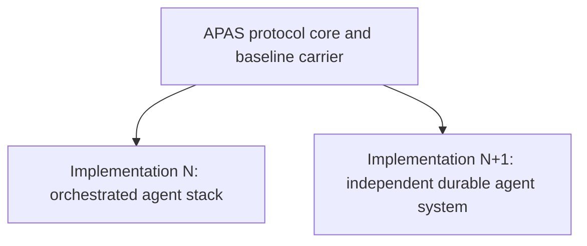

# Agent Provenance Attestation Standard (APAS)

**Version**: APAS 0.4.0-draft
**Status**: Draft
**Authors**: Agentic Research
**Date**: 2026-08-12

APAS versions independently of every implementation. Always include the `APAS`
prefix when naming a version. Tags for this document use the
`apas/vX.Y.Z` namespace so they cannot be confused with implementation releases.

> **APAS 0.4 changes conformance semantics.** It defines conformance over a
> bounded agent Activity and declared evidence scope, makes assurance levels
> cumulative, and separates the protocol core from implementation profiles.
> Mechanisms inherited from the original ART implementation remain available
> in a non-normative profile; they are no longer universal requirements.

The key words MUST, MUST NOT, REQUIRED, SHALL, SHALL NOT, SHOULD, SHOULD NOT,
RECOMMENDED, NOT RECOMMENDED, MAY, and OPTIONAL in this document are to be
interpreted as described in BCP 14 when, and only when, they appear in all
capitals.

## Abstract

The Agent Provenance Attestation Standard (APAS) is a protocol for recording,
authenticating, appraising, and reconstructing the provenance of bounded AI-agent
Activities. An Activity is in scope when an AI Agent observes inputs, influences
decisions, invokes tools, or produces outputs whose provenance a Relying Party
needs to evaluate.

APAS defines a shared ontology, an additive assurance model, and a baseline
attestation carrier. It does not prescribe an orchestrator, runtime, isolation
technology, identity provider, storage system, or deployment topology. A
long-lived Workload may perform many Activities, and an Activity may span
multiple processes, machines, or periods of suspension. Workload identity and
Activity identity are therefore related but distinct.

### 0.1 Protocol roles

APAS uses established provenance and remote-attestation roles. A component MAY
fill more than one role, except where a claimed assurance level requires those
roles to be independently controlled.

| Role | APAS meaning |
|---|---|
| **AI Agent** | Software or a model-mediated system that observes, decides, invokes tools, or emits outputs during an Activity. In W3C PROV terms it is an Agent associated with the Activity. |
| **Workload** | A deployed software instance or collection of code and configuration that performs Activities. Its identity may be expressed using SPIFFE or another identity system. |
| **Attester** | Produces Evidence about an Activity, Workload, execution boundary, or Entity. |
| **Verifier** | Appraises Evidence against policy and produces an Attestation Result. |
| **Relying Party** | Uses an APAS attestation or Attestation Result to make a decision. |

The complete vocabulary is normative and defined in Appendix A.

### 0.2 Normative references

APAS reuses these specifications rather than creating incompatible equivalents:

| Specification | APAS use |
|---|---|
| [RFC 2119](https://www.rfc-editor.org/rfc/rfc2119) and [RFC 8174](https://www.rfc-editor.org/rfc/rfc8174) | Normative requirement language (BCP 14) |
| [W3C PROV-DM](https://www.w3.org/TR/prov-dm/) | Entity, Activity, Agent, Plan, and causal relations |
| [SPIFFE Concepts](https://spiffe.io/docs/latest/spiffe-about/spiffe-concepts/) | Workload and Workload identity terminology |
| [IETF RATS Architecture, RFC 9334](https://www.rfc-editor.org/rfc/rfc9334) | Attester, Evidence, Verifier, Attestation Result, and Relying Party roles |
| [CloudEvents 1.0](https://github.com/cloudevents/spec/blob/v1.0.2/cloudevents/spec.md) | Event records of Occurrences |
| [in-toto Statement v1](https://in-toto.io/Statement/v1) | Baseline attestation statement |
| [DSSE](https://github.com/secure-systems-lab/dsse/blob/master/protocol.md) | Baseline authentication envelope at L2 and above |
| [SLSA v1.0](https://slsa.dev/spec/v1.0/) | Additive assurance and protected provenance generation |

OpenTelemetry Events and software-bill-of-materials formats are informative
integrations, not APAS ontology or carrier requirements.

### 0.3 Protocol architecture

The protocol sits above implementations. Implementations are siblings: they
interoperate through APAS records and profiles, not by depending on one another.



An implementation can distribute APAS roles across a hypervisor, cluster
service, agent runtime, identity authority, and storage tier, or combine them
where the claimed assurance level permits. Topology is expressed by profiles;
it is not part of the core ontology.

### 0.4 Activity lifecycle

An Activity has a stable identity and one or more Segments. Suspension ends a
Segment without ending the Activity. A conforming resume starts a new Segment
under the same Activity only after continuity has been verified.

```mermaid
stateDiagram-v2
  [*] --> Active: start Event
  Active --> Active: append Event
  Active --> Suspended: suspend and checkpoint
  Suspended --> Active: verify continuity; start new Segment
  Active --> Ended: end Event
  Suspended --> Ended: cancel, expire, or unrecoverable error
  Ended --> [*]
```



Continuity binds the checkpoint, effective authority, and every
behavior-changing configuration input. `Ended` is terminal: retrying work
creates a new Activity and MAY relate it to the prior Activity. Lifecycle state,
termination reason, and work outcome are distinct claims. For example, an
Activity may end normally with a failed outcome, or expire with an unknown
outcome.

## 1. Problem statement

AI agents increasingly modify source code, operate services, reconcile desired
state, and produce decisions consumed by other systems. Existing software supply
chain records identify components and build steps, but do not necessarily capture
the bounded agent Activity that selected inputs, invoked tools, exercised
authority, and generated an output. Without that provenance:

- agent work may be indistinguishable from human or conventional automation;
- compromised agent infrastructure can inject outputs through a trusted path;
- investigators cannot reliably connect outputs to relevant inputs, tool use,
  authority, or lifecycle transitions; and
- Relying Parties cannot verify that declared execution constraints were
  independently observed and appraised.

APAS addresses the record and its assurance. It does not establish that an
agent's reasoning was correct, require disclosure of private chain-of-thought,
or replace review of the resulting work.

### 1.1 Supply-chain lessons

The March 2026 compromise of Trivy demonstrated three lessons relevant to agent
provenance:

1. Mutable references are attack surfaces; security-relevant inputs and outputs
   need content-bound identities.
2. Long-lived, ambient credentials increase persistence and blast radius;
   authority should be short-lived, scoped, and attributable to its use.
3. Self-recording is not independent appraisal; stronger claims require a
   Verifier and protected authority outside the Activity being appraised.

These lessons constrain APAS assurance claims without prescribing one runtime or
credential format.

### 1.2 Why an SBOM is insufficient

SBOMs such as CycloneDX and SPDX answer, “Which components are present?” APAS
answers, “Which bounded agent Activity used and generated these Entities, which
Agent and Workload were associated with it, what relevant Occurrences were
recorded as Events, under what authority did it operate, and what Evidence
supports those claims?”

| Property | SBOM | APAS provenance |
|---|---|---|
| Primary subject | Components | Agent Activity and related Entities |
| Temporal model | Inventory or point-in-time snapshot | Lifecycle, Segments, Events, and causal relations |
| Identity | Package or publisher | Activity, Agent, Workload, Evidence producer, and authority |
| Verification | Digests and publisher metadata | Authenticated records and, at higher levels, independent appraisal |
| Outcome | Component presence | Distinct lifecycle, termination, and work-outcome claims |

A Workload is not an Activity. A Workload is long-lived deployed software and
may conduct many Activities. An Activity is the bounded provenance subject whose
identity persists across its Segments. A process, job, request, dispatch, run,
reconciliation, or capsule MAY map to an Activity or Segment under a topology
profile, but none of those implementation terms is universal.

## 2. Assurance levels

APAS defines four cumulative assurance levels. A level is claimed for one
Activity and one declared evidence scope, not for a product, cluster, or
collection of components in the abstract. A conforming claim MUST identify the
APAS version, claimed level, Activity, evidence scope, and applied profiles.

### 2.0 Conformance rule

Each higher level includes every requirement of the preceding level for the same
Activity and evidence scope. Profiles MAY add requirements or define mechanisms,
but MUST NOT waive, weaken, or silently reinterpret a core requirement.
Implementation status and reference mappings are non-normative.

Properties supplied by different components cannot be mechanically unioned into
a level. For example, a protected runtime, an unrelated signed log, and a
separate identity service do not jointly establish L3 unless their Evidence and
identities are bound to the same Activity, scope, and causal record.

Every level below states explicit failure conditions. A claim that cannot be
falsified from the declared records and Evidence is not a conformance claim.
Algorithms, envelope encodings, product names, and deployment topology belong in
the baseline carrier or profiles unless a level explicitly requires a security
property they provide.

### L1 — Recorded Agent Activity

**Requirement:** The Activity is represented by a structured record sufficient
to identify its declared provenance and interpret its lifecycle and outcome.

An L1 record MUST contain:

- a stable Activity identity that correlates every Segment, including Segments
  before and after suspension;
- the associated AI Agent and Workload identity, including the model and model
  provider when known and an explicit unknown value when not known;
- references to behavior-changing input Entities and generated output Entities;
- Events for tool operations and other Occurrences relevant to the declared
  capture scope;
- lifecycle state, termination reason, and work outcome as separate fields;
- claimed causal relations among the Activity, Agent, Plan, Entities, Events,
  and any parent or child Activities; and
- a declared capture scope identifying intentionally omitted classes of Events,
  Entities, or data.

L1 is a forensic record, not a security boundary. Its producer may alter or
forge it, and unknown information remains unknown even when the record is
well-formed.

**Fails** if resume loses the stable Activity correlation; a relevant tool
operation inside the declared capture scope is omitted; unknown model, time,
origin, or outcome data is represented as known; or termination/completion can
be interpreted as successful work without a distinct outcome claim.

### L2 — Authenticated Provenance

**Requirement:** L2 includes L1 and authenticates the Activity record and its
Evidence references so a third party can verify who produced each claim and
whether its signed content changed.

An L2 APAS attestation MUST:

- authenticate the complete L1 information set and every Evidence reference
  within the claimed evidence scope;
- name the producer identity in a form a Relying Party can bind to an
  independently configured trust policy;
- permit offline or third-party verification without treating the producer or
  the producer's current transport endpoint as the sole trust anchor;
- fail closed when signing authority is absent, unreadable, expired, revoked, or
  otherwise unusable; and
- bind claimed ordering or causal predecessor relations into authenticated
  content rather than filenames, timestamps, or storage layout alone.

L2 establishes authenticity and tamper evidence for the producer's claims. It
does not establish that the producer observed the Activity correctly, that the
Activity was isolated, or that a signed claim is true.

**Fails** if a signed-looking artifact can be emitted with an empty or missing
signature; verification accepts trust material supplied only by the same
untrusted producer as its root; an Evidence reference can be substituted without
invalidating authentication; or records that claim strict order can be reordered
without detection.

### L3 — Independently Appraised Execution

**Requirement:** L3 includes L2 and binds the Activity to protected execution
Evidence that is appraised by a Verifier outside the Activity's authority.

For L3:

- security-relevant Evidence MUST be protected from alteration or deletion by
  the Activity after the underlying Occurrences take place;
- the Activity and its Workload MUST NOT have access to the Verifier's protected
  appraisal state or Attestation Result signing authority;
- unrelated Activities MUST be isolated from observing or altering one another's
  private execution state except through declared channels;
- the effective tool, filesystem, network, credential, and other capability set
  MUST be bounded, declared, enforced, and default-deny;
- the declaration MUST describe what the Activity could do, not only what the
  record says it did; and
- a Verifier independent of the Activity MUST appraise the protected Evidence
  and bind its Attestation Result to the Activity and evidence scope.

Interactive authorization and predeclared capabilities are both valid
mechanisms when they fail closed. Advisory metadata is not enforcement. A label
such as “destructive” or “read-only” does not change the capability set unless a
boundary refuses disallowed operations.

L3 supports the claim that the declared execution constraints were independently
observed and appraised. It does not establish that inputs were benign, the Agent
made correct decisions, or the resulting work succeeded.

**Fails** if the Activity can forge or rewrite its protected receipts; protected
history is mutable without detection; the Activity can use the appraisal key or
modify Verifier policy/state; unrelated Activities can read or modify each
other's undeclared state; an undeclared operation succeeds; or an Attestation
Result is not bound to the same Activity and Evidence being claimed.

### L4 — Content-complete Reconstruction

**Requirement:** L4 includes L3 and provides authenticated commitments sufficient
to detect omission, reordering, substitution, or mutation of every captured item
needed to reconstruct the Activity within its declared scope.

For L4:

- every behavior-changing input MUST be bound by content, including instructions,
  context, model and sampling configuration, tool definitions, policy,
  credentials or authority, and resume configuration;
- the Workload and runtime MUST be identified precisely enough to distinguish
  behavior-relevant builds and configuration;
- generated outputs and the Event history MUST be retained or committed by
  content sufficiently for reconstruction within the declared capture scope;
- each behavior-changing input MUST resolve to origin Evidence or an explicit
  `origin-unknown` claim; origin coverage does not imply that an origin is
  trusted or content is safe;
- continuity across Segments MUST bind the checkpoint, effective authority, and
  behavior-changing configuration, and missing or reordered Segments MUST be
  detectable;
- mutation of a referenced Plan, input, output, checkpoint, Event, Evidence item,
  or other reconstructed Entity MUST be detectable; and
- the attestation MUST declare retention, redaction, sampling, and confidentiality
  limits so omitted content cannot be mistaken for complete capture.

L4 establishes content-complete reconstruction only within the declared capture
scope. Cryptographic integrity and attribution do not prove semantic correctness,
safety, policy fitness, determinism, or a successful outcome.

**Fails** if changing a behavior-relevant input can leave all authenticated
commitments unchanged; a resume can preserve Activity identity after checkpoint,
authority, or configuration drift; a Segment or captured Event can be removed or
reordered without detection; mutation of retained content is undetectable; origin
absence is treated as trusted origin; or sampled/redacted records are presented
as complete.

### 2.5 Content origin across levels

Content origin is an Entity and Evidence property, not a fifth assurance level.
It is meaningful from L2 upward because an unauthenticated origin record can be
revised by the same party that chose what to consume. L2 authenticates the
claim; L3 can protect Evidence of how content entered the Activity; L4 requires
coverage for every behavior-changing input, including an explicit
`origin-unknown` claim when no origin Evidence exists.

Origin coverage and origin trust are different. L4 requires the former so
silence cannot masquerade as knowledge. A Relying Party's policy decides whether
`origin-asserted`, `origin-unknown`, or only `origin-attested` content is
acceptable.

This matters because the usual way to keep an agent safe is to shrink what
it may read — a hardcoded safelist of sources. That does not scale: every
new source is a policy change, and a context-starved agent produces worse
work, which pressures operators into widening the list anyway.

Content origin does **not** make a wider corpus safer. Be precise about what
it buys, because the temptation to overclaim here is exactly how a standard
becomes a rubber stamp: origin makes the *record* of what was consumed
complete and attributable. Widening the corpus remains a risk decision. What
changes is that it becomes an **accountable** one — after an incident you can
enumerate what the Activity consumed and who vouched for each source, and
before one you can require that everything consumed be `origin-attested`
under your own trust set. A safelist answers "may I read this?" once, at
policy-authoring time, and then stops recording. Origin answers it
continuously and leaves evidence.

The honest summary: safelists trade capability for safety; origin trades
neither, and instead converts an invisible risk into a measured one.
§4's threat model states the residue plainly — poisoned input is
*attributed*, not *detected*.

**Origin entry.** An origin entry is a pair:

    OriginEntry := (uri, vouchedBy)

`uri` names where the content came from. `vouchedBy` is a single
**authority identifier** — the name of the party vouching for that
attribution. It is deliberately not a boolean, and deliberately not a list:
content vouched by two authorities is *two entries*, which keeps both the
ordering comparator and the dedup rule defined over a pair of plain
strings.

> **Why an authority, not a trust bit.** The point of ingest cannot know
> the evaluator's trust set. A substrate that stamps `trusted: true` has
> encoded *its* opinion into a record that some other party, with a
> different trust set, must later evaluate. Recording *which authority
> vouched* keeps the record a statement of fact and defers the judgment to
> whoever is judging.

An empty `vouchedBy` (the empty string) is an ordinary, expressible state
— "ingested, unvouched" — not an error and not an absence. A system that cannot express
"I have this content and nobody vouches for where it came from" will
instead express nothing, and silence is the worst record.

**Composition.** Content derived from multiple sources carries the union of
their origin entries, canonically ordered and deduplicated by the *pair*.
The same URI vouched by two authorities is two entries, because it is two
facts — and collapsing them into one entry with two authorities would
destroy the total ordering that makes origin sets comparable.

**Derived confidence.** Confidence is not stored; it is *derived* at
evaluation time from an origin set and the evaluator's own trusted-authority
set:

| Confidence | Condition |
|---|---|
| `origin-attested` | every entry is vouched by an authority the evaluator trusts |
| `origin-asserted` | origins are recorded, but some are unvouched or vouched by an untrusted authority |
| `origin-unknown` | no origin information (**including the empty set**) |

Derivation MUST fail closed: an empty origin set yields `origin-unknown`, never
`origin-attested` by vacuous truth. An implementation MUST NOT equate L4 origin
coverage with an `origin-attested` trust decision.

**The category line (normative).** *Who submitted* content is a fact about an
Agent or authority associated with an Activity. *Where the Entity's content came
from* is an origin claim about that Entity. An implementation MUST NOT fold the
submitting identity into the content's origin set.

> This is not a style preference; it was learned by getting it wrong. An
> early cut of the reference implementation unioned the authenticated
> submitter into every content origin set. The result inverted the
> incentive: a caller who declared nothing got `origin-attested` (the only
> entry being their own authenticated identity), while a caller who
> honestly declared an untrusted upstream got `origin-asserted`. Silence
> outranked honesty. Worse, it let an authenticated identity launder itself
> into content provenance — the exact confusion between "I know who is
> talking" and "I know what they are telling me about" that this section
> exists to prevent.

**Bounds.** Declared origin sets MUST be bounded (the reference
implementation uses 64 entries, 2048 bytes per URI) and an over-limit
declaration MUST be **refused, not truncated** — truncating records a claim
narrower than the caller actually made, which is a forged record rather
than a partial one.

**Privacy.** An origin set is disclosure surface: source URIs are an agent's
read history, and publishing them is a strictly richer oracle than whatever
existence-leak the carrier already had. The rule therefore depends on *who
can read the carrier*, not on what kind of artifact it is:

- **Broadcast carriers** — anything readable by parties not entitled to the
  origins, such as a response header returned to every caller or a public
  attestation feed — MUST carry only `originsHash`, a digest over the
  canonical encoding.
- **Scoped carriers** — a record whose distribution is already restricted
  to entitled parties, such as an attestation held at rest in an access-
  controlled store — MAY carry the full array.

An implementation MUST decide which case a given carrier is, and MUST
default to the digest when unsure. A signed attestation is *not*
automatically a scoped carrier: signing establishes integrity, never
confidentiality.

**What it proves**: "This content's attribution is recorded, and named
authorities stand behind that attribution."

**What it does NOT prove**: that the content is safe, correct, or
non-malicious — see §4.2. Origin is *accountability*, not safety.

## 3. Baseline carrier and profiles

APAS defines one baseline logical statement so independently developed
implementations can exchange the same claims. The baseline carrier is an in-toto
Statement v1. L1 MAY store the logical statement without authentication; L2 and
higher MUST authenticate it with DSSE as specified in §3.4.

### 3.1 Baseline logical statement

The statement MUST contain or unambiguously reference:

- the APAS version, claimed assurance level, and every applied Profile name and
  version;
- one Activity identity, lifecycle state, and Segment identities;
- the associated AI Agent and Workload identities, including model identity when
  known;
- subject Entity digests, used and generated Entities, and their causal
  relations;
- a Plan reference when the Activity follows declared intent;
- inline Events or authenticated commitments to Event records;
- Evidence references scoped to the Activity or a Segment;
- termination reason and work outcome as distinct values;
- an Attestation Result at L3 and L4;
- the declared capture scope, including retention, sampling, redaction, and
  confidentiality limits; and
- origin Evidence or explicit origin status where required by §2.5.

A carrier field MAY be absent only when the baseline declares it optional and
the omission is semantically distinct from a known empty or unknown value.
Profiles MUST NOT collapse these states where a core requirement depends on the
distinction.

### 3.2 Generic in-toto Statement

This L2 example uses generic protocol vocabulary. Digests and identifiers are
illustrative.

```json
{
  "_type": "https://in-toto.io/Statement/v1",
  "subject": [
    {
      "name": "urn:example:entity:result",
      "digest": {
        "sha256": "5f70bf18a086007016e948b04aed3b82103a36be2d0e9b74066b7f7932f79a8c"
      }
    }
  ],
  "predicateType": "https://notme.bot/provenance/activity/v1",
  "predicate": {
    "apasVersion": "0.4.0-draft",
    "profiles": [
      "apas:carrier:in-toto-dsse/v1",
      "example:topology:durable/v1",
      "example:identity:workload/v1"
    ],
    "claimedLevel": "L2",
    "activity": {
      "id": "urn:uuid:1af73f40-d22b-4abc-a318-1fb990f0bd70",
      "state": "Ended",
      "segments": [
        "urn:uuid:316606ef-e727-42eb-8fd3-04cad1f6d65d"
      ],
      "terminationReason": "completed",
      "outcome": "degraded"
    },
    "agent": {
      "id": "urn:example:agent:change-reviewer",
      "model": {
        "provider": "example-provider",
        "name": "example-model",
        "version": "2026-08-01"
      }
    },
    "workload": {
      "identity": "spiffe://example.org/ns/agents/sa/reviewer",
      "artifact": {
        "sha256": "1111111111111111111111111111111111111111111111111111111111111111"
      }
    },
    "plan": {
      "id": "urn:example:plan:review-change",
      "digest": {
        "sha256": "2222222222222222222222222222222222222222222222222222222222222222"
      }
    },
    "used": [
      {
        "id": "urn:example:entity:change-request",
        "digest": {
          "sha256": "3333333333333333333333333333333333333333333333333333333333333333"
        },
        "originStatus": "origin-unknown"
      }
    ],
    "generated": [
      {
        "id": "urn:example:entity:result",
        "digest": {
          "sha256": "5f70bf18a086007016e948b04aed3b82103a36be2d0e9b74066b7f7932f79a8c"
        }
      }
    ],
    "events": [
      {
        "source": "urn:example:workload:reviewer",
        "id": "urn:uuid:fa0b47a3-6cb0-4cf7-a9c3-035aecf4f16e",
        "type": "org.example.tool.completed",
        "activity": "urn:uuid:1af73f40-d22b-4abc-a318-1fb990f0bd70",
        "segment": "urn:uuid:316606ef-e727-42eb-8fd3-04cad1f6d65d",
        "occurrenceTime": "2026-08-12T16:00:00Z",
        "entities": [
          "urn:example:entity:change-request",
          "urn:example:entity:result"
        ],
        "data": {
          "tool": "change-analysis",
          "result": "completed"
        }
      }
    ],
    "evidence": [
      {
        "profile": "example:evidence:tool-receipt/v1",
        "mediaType": "application/json",
        "digest": {
          "sha256": "4444444444444444444444444444444444444444444444444444444444444444"
        },
        "producer": "spiffe://example.org/ns/evidence/sa/recorder",
        "scope": {
          "activity": "urn:uuid:1af73f40-d22b-4abc-a318-1fb990f0bd70",
          "segment": "urn:uuid:316606ef-e727-42eb-8fd3-04cad1f6d65d"
        }
      }
    ],
    "captureScope": {
      "eventClasses": [
        "tool",
        "lifecycle",
        "output"
      ],
      "sampling": "none",
      "redactions": [],
      "retention": "content-addressed",
      "confidentiality": "restricted"
    }
  }
}
```

The predicate URI is a versioned identifier. It is not a trust anchor, an online
dependency, a requirement to dereference the URI, or a requirement to use Notme
credentials or services. Verifiers match its value literally and establish trust
through an identity Profile.

### 3.3 Event and Evidence references

An inline Event MUST identify its source, Event ID, type, Activity, and the
Occurrence time or an explicit unknown value. It MUST identify its Segment when
Segment attribution is known. It SHOULD reference relevant Entities and MAY
carry Profile-defined data.

When strict ordering is claimed, each Event or Event commitment MUST carry a
sequence value or authenticated causal predecessor. Wall-clock timestamps alone
do not establish order. An Event records an Occurrence; the Event record can
also be an Entity and Evidence.

An Evidence reference MUST contain:

- a named, versioned Evidence Profile;
- media type and content digest;
- producer identity; and
- Activity scope, plus Segment scope when applicable.

At L3 and L4, the Attestation Result MUST identify the Verifier, appraisal policy
or policy digest, appraised Evidence, result, and Activity scope.

### 3.4 DSSE authentication at L2 and above

The in-toto Statement is the DSSE payload:

```json
{
  "payloadType": "application/vnd.in-toto+json",
  "payload": "eyJfdHlwZSI6Imh0dHBzOi8vaW4tdG90by5pby9TdGF0ZW1lbnQvdjEiLCIuLi4iOiIuLi4ifQ==",
  "signatures": [
    {
      "keyid": "sha256:5555555555555555555555555555555555555555555555555555555555555555",
      "sig": "MEUCIQDfZXhhbXBsZS1zaWduYXR1cmUtYnl0ZXMCIQCZmFrZS1idXQtd2VsbC1mb3JtZWQ="
    }
  ]
}
```

The algorithm, key identifier semantics, credential lifetime, and trust mechanism
come from the applied identity Profile. Failure to obtain usable signing
authority MUST NOT produce a DSSE-shaped artifact with no valid signature. An
implementation MAY emit a clearly unauthenticated L1 record instead when policy
explicitly permits it.

An alternative carrier MAY be used only when it names its carrier Profile and
maps losslessly to the baseline logical statement. A Relying Party MUST be able
to distinguish an alternate carrier from the baseline and recover every
normative distinction needed for the claimed level.

### 3.5 Composable Profile axes

Profiles are named and versioned. They compose along independent axes:

| Axis | Defines |
|---|---|
| **Carrier** | Serialization, envelope, canonicalization, and transport mapping |
| **Activity topology** | How implementation units map to Activities, Segments, parent/child relations, and resume |
| **Evidence** | Evidence types, producers, protection, appraisal, and disclosure |
| **Identity** | Agent, Workload, Attester, Verifier, authority, key, and trust semantics |
| **Implementation** | A documented composition of the other Profiles plus implementation-specific fields |

An **orchestrated topology** may map a bounded delegated execution to an
Activity and pipeline stages to child Activities or Segments. A **durable
topology** may preserve one Activity across checkpoints and process boundaries.
A **reconciliation topology** may represent convergence toward desired state as
an Activity and each attempt or turn as a Segment or child Activity. These
topologies are composable and none is the protocol's privileged shape.

### 3.6 ART implementation and compatibility Profile (non-normative)

The ART Profile preserves the mechanisms from earlier APAS drafts without making
them universal. Its complete implementation is the composition of Rosary,
Cloister, Ley-line-open, Signet, Notme, and Mache; no component alone inherits
the composition's aggregate assurance level.

The legacy predicate
`https://notme.bot/provenance/dispatch/v1` remains a compatibility carrier. An
ART verifier maps it to `activity/v1` as follows:

| ART field or mechanism | APAS mapping |
|---|---|
| dispatch ID and session | Activity and Segment identities |
| agent definition, provider, model | AI Agent association and behavior-changing Entities |
| work-item reference and pipeline | Plan, input Entity, parent/child Activity topology |
| execution timestamps and isolation | lifecycle Events and execution Evidence |
| permission profile and mediated tool calls | declared capability set and capability-use Events |
| commits and changed files | generated Entities |
| verification tiers | Evidence or Attestation Result, depending on producer independence |
| cost and token usage | Profile-defined Event data |
| outcome and stop reason | distinct outcome and termination reason |
| handoff chain | Segment or child-Activity causal commitments |

ART identity decomposes Owner, Machine, Actor, and Identity. Signet bridge
certificates bind a short-lived X.509/Ed25519 identity to a running dispatch;
that dispatch maps to an Activity or Segment according to the topology Profile.
Owner identifies the authorizing principal, Machine the host, Actor the agent
definition, and Identity the cryptographic binding. The shared signing primitive
supports RFC 5652 signed attributes and RFC 8419 PureEdDSA. Existing Rosary
handoff envelopes use DSSE with an Ed25519 path; consolidation on the shared
primitive is implementation status, not conformance semantics.

The Profile retains phase handoffs, work-item hierarchy, git commits, file
changes, verification tiers, cost, and the following SHA-256 commitments:

```text
H(FileChange)        = SHA256(path || old_content || new_content)
H(ToolCall)          = SHA256(tool_name || input_hash || output_hash || timestamp)
H(Action)            = SHA256(H(ToolCall_0) || ... || H(ToolCall_n))
H(Phase)             = SHA256(agent_definition || dispatch_identity || provider || H(Action) || H(previous_phase))
H(WorkItem)          = SHA256(H(Phase_0) || ... || H(Phase_n))
H(WorkItemGroup)     = SHA256(H(WorkItem_0) || ... || H(WorkItem_m))
H(WorkItemLifecycle) = SHA256(H(WorkItemGroup_0) || ... || H(WorkItemGroup_k))
```

In Rosary, WorkItem maps to a bead, WorkItemGroup to a thread, and
WorkItemLifecycle to a decade. Git object IDs are committed as opaque values
inside APAS SHA-256 commitments, regardless of the repository's git object
format. The shipped handoff chain commits phase number, agent, bead ID, summary,
changed paths, commit IDs, and the previous handoff hash; it does not yet cover
every input in the target `H(Phase)`.

Ley-line-open supplies content-addressed execution contracts, receipts, and
storage primitives. Their CAS digests map to Entity and Evidence digests; the
digest algorithm and canonical bytes MUST be identified by the ART Carrier or
Evidence Profile rather than inferred from an object-store path. Cloister's
runtime permission mediation and declared filesystem, network, port, and tool
boundaries map to L3 capability declarations and protected Evidence.

The ART origin encoding preserves these rules:

- `contentOrigins` is a canonically ordered array of `{uri, vouchedBy}`
  entries on a scoped carrier; `originsHash` is the digest-only form on a
  broadcast carrier, and the two fields are mutually exclusive.
- Absent origin data and a present empty array both derive
  `origin-unknown`, but their record semantics remain distinct where the
  carrier can express the distinction.
- `vouchedBy: ""` means ingested but unvouched and MUST NOT be normalized away.
- Entries sort by `uri` and then `vouchedBy` as ASCII byte sequences and are
  deduplicated by the entire pair.
- Agent, orchestrator, and submitter identities are not origin entries.
- Disclosure defaults to `originsHash` when carrier confidentiality is
  uncertain.

### 3.7 Causality, ordering, and completeness

APAS uses W3C PROV-style relations:

- an Activity `used` an input Entity;
- an output Entity `wasGeneratedBy` an Activity;
- an Activity `wasAssociatedWith` an AI Agent and Workload;
- a Segment or child Activity `wasInformedBy` its authenticated predecessor;
- parent/child relations express decomposition; and
- an Event records an Occurrence affecting an Activity and references the
  relevant Entities.

Content digests bind identity to bytes but do not by themselves prove sequence
or completeness. When an attestation claims strict ordering or complete capture,
it MUST authenticate sequence numbers, causal predecessor links, a content-linked
hash chain, a Merkle commitment, or an equivalent omission-detecting structure.
The chosen structure and canonicalization belong to a Carrier or Evidence
Profile.

Timestamps, filenames, storage order, sampled telemetry, and a collection of
otherwise valid signatures do not prove completeness. A chain root is a
commitment, not automatically a trust root; the Relying Party still evaluates
who authenticated it and what capture scope it covers.
## 4. Security and adversarial model

APAS separates record authenticity, protected observation, appraisal, and
semantic judgment. Each level narrows specific attacks; none turns provenance
into proof that an Agent's decisions or outputs are correct.

### 4.1 Threat coverage

| Threat or failure | Required response |
|---|---|
| Forged producer or Workload identity | L2 authentication binds a named producer to independently configured trust. |
| Tampered Activity record | L2 detects changes to authenticated statement content. |
| Substituted or unbound Evidence | L2 binds Evidence references; L3 binds the Verifier's appraisal to the same Activity and Evidence. |
| Activity forges or rewrites execution receipts | L3 protects Evidence outside the Activity's authority. |
| Unauthorized capability use | L3 enforces a declared, default-deny capability set; an undeclared successful operation invalidates the claim. |
| Missing or sampled Events presented as complete | L1 requires an honest capture scope; L4 requires omission-detecting commitments for complete-capture claims. |
| Missing or reordered Segments | L4 makes the discontinuity detectable and prevents unverified continuity from preserving Activity identity. |
| Checkpoint, authority, or configuration drift on resume | L4 requires continuity verification or a new Activity identity. |
| Input or output mutation | L4 content commitments detect substitution within the declared scope. |
| Unknown origin represented as trusted | §2.5 requires fail-closed evaluator-derived confidence and explicit `origin-unknown` coverage at L4. |
| Origin disclosure leaks an Agent's read history | Broadcast carriers disclose only a digest commitment; full origin sets require scoped disclosure. |
| Termination represented as successful work | L1 separates lifecycle state, termination reason, and work outcome. |
| Appraisal represented as work outcome | L3 keeps Attestation Result distinct from Activity outcome. |
| Compromised model provider | APAS preserves attributable Evidence but does not prevent semantically malicious model behavior. |

A threat marked “detected” is detected only when the affected item lies inside
the attestation's declared evidence and capture scope. A producer that lies about
scope is not made honest by its own signature; L3 independent appraisal and L4
protected completeness commitments exist to reduce that trust.

### 4.2 Threats and properties not addressed

1. **Semantic correctness and safety.** A valid attestation can describe a wrong,
   unsafe, degraded, or malicious result. APAS records provenance and appraisal;
   domain review remains separate.
2. **Compromised model provider.** A poisoned provider can produce malicious
   output through an otherwise conforming Activity. Diversity of providers,
   adversarial review, and content policy are external mitigations.
3. **All covert channels.** L3 constrains declared channels but cannot guarantee
   elimination of timing, resource, model-output, or other covert channels.
4. **Time-of-check/time-of-use outside committed scope.** Mutable state used
   after appraisal can invalidate the practical decision unless snapshotting or
   an equivalent atomic binding is applied.
5. **Self-attestation below L3.** L1 and L2 may be valuable forensic records, but
   a compromised producer can emit authentic falsehoods. L3 adds independent
   protected observation and appraisal.
6. **Origin is not safety.** `origin-attested` means trusted authorities vouch
   for attribution. A correctly attributed source can still be malicious.
7. **Origin confidentiality.** Digest-only disclosure reduces read-history
   exposure but still leaks equality and change across observations.
8. **Private reasoning.** APAS does not require hidden chain-of-thought. It
   records observable outputs, tool and lifecycle Events, and rationale only
   when the Agent or application explicitly declares that rationale as output.

## 5. Relationship to existing standards

| Standard | APAS relationship |
|---|---|
| **W3C PROV** | Supplies Entity, Activity, Agent, Plan, and causal relations. APAS specializes them for bounded AI-agent work. |
| **SPIFFE** | Supplies Workload and Workload identity vocabulary. A SPIFFE ID may identify a Workload; it does not identify the Activity by itself. |
| **IETF RATS** | Supplies Attester, Evidence, Verifier, Attestation Result, and Relying Party roles used by L3 appraisal. |
| **in-toto** | Supplies the mandatory baseline Statement carrier and subject/predicate separation. |
| **DSSE** | Supplies the mandatory L2+ authentication wrapper for the baseline carrier. |
| **SLSA** | Provides precedent for cumulative assurance and protected provenance generation; APAS applies those ideas to agent Activities. |
| **CloudEvents** | Informs Event as a record of an Occurrence with source, type, identity, time, and data. |
| **OpenTelemetry** | MAY encode Event, trace, or span Evidence. Sampled telemetry is not proof of complete provenance. |
| **CycloneDX** | Complements APAS with software and AI/ML component inventory; inventory is not an Activity history. |
| **Sigstore** | MAY be used by an identity Profile for keyless signing, certificates, and transparency; it is not required by the core. |

## 6. Non-normative implementation mappings

This section tests the protocol against two sibling implementation shapes. It
does not add conformance requirements. An implementation claims a level only
when authenticated Evidence covers every requirement of that level for the same
Activity and declared scope.

### 6.1 ART composition

The first implementation is a composition, not a single daemon or trust domain.

| Component | APAS mapping |
|---|---|
| **Rosary** | Plans, capsules and Activities, phase child Activities, Events, handoffs, outcomes, work decomposition, and orchestration lineage |
| **Cloister** | Enforced execution boundaries, capability Evidence, receipts, event-stream commitments, and content-origin production |
| **Ley-line-open** | Execution contracts, CAS Entities, receipt and storage primitives, signature primitives, and reproducible content commitments |
| **Signet** | Principal and Workload identity, delegated Activity identity, signature production, and trust verification |
| **Notme** | Principals, delegation, authority, and the public predicate/schema namespace |
| **Mache** | Projected repository and code context represented as input Entities with attributable origins |

Cloister deliberately separates the execution boundary from appraisal authority.
The hypervisor tier enforces isolation and produces boundary/capability Evidence;
a cluster-tier Verifier or appraiser, outside the Activity's authority, evaluates
that Evidence and signs the Attestation Result. This separation is how the
composition can satisfy L3; a sandbox receipt signed only by the sandboxed
Activity would not.

Within that composition, a Rosary capsule or bounded dispatch maps to an
Activity. A pipeline phase may be a child Activity when it has its own authority,
outcome, or independently useful provenance; otherwise it may be a Segment.
Rosary Events record orchestration Occurrences. A Cloister RunSpec is a Plan or
intent Entity, a RunGrant is an authorization Entity, and a RunReceipt is
aggregate terminal Evidence. Ley-line-open CAS objects bind the referenced
Entities and Evidence by content. Signet and Notme express principals,
delegation, identities, and verifier trust.

The composition is intended to stack additively:

- Rosary's structured records provide portions of L1.
- Signet/DSSE authentication can provide L2 only when it covers the complete L1
  statement and Evidence references.
- Cloister plus cluster-tier appraisal can provide L3 only when protected
  Evidence and Attestation Result bind the same Activity.
- CAS retention, complete Event/Segment commitments, origin coverage, and resume
  continuity can provide L4 only when all L4 inputs and outputs are covered.

No component inherits the aggregate level merely because another component has a
needed feature. Current implementation status remains separate from the protocol:
legacy `dispatch/v1`, partial handoff signing, and substrate receipts require
the `activity/v1` bindings described in §3 before the composition can claim the
corresponding complete level.

### 6.2 Anonymous durable-reconciliation implementation

A second, independently designed system maps a stable reconciliation run to an
Activity. Turns and tool operations are Events; process-bound execution periods
are Segments; checkpoints are Entities; configuration digests bind resume; and
an OCI artifact is the Workload subject. The system uses a separately designed
keyless signing and transparency stack rather than ART identity or storage.

This example validates the ontology:

- one Activity survives suspension and process replacement;
- resume keeps its identity only after checkpoint and behavior-changing
  configuration are verified;
- reconciliation attempts can be Segments or child Activities;
- a committed result remains distinct from a successful work outcome; and
- Workload identity remains distinct from Activity identity.

It does not yet establish L2 APAS conformance. Reconciliation status is signed,
but the Activity trace and tool Events are unsigned telemetry, the checkpoint
input digest is not bound into an APAS attestation, and no authenticated causal
commitment covers all Segments. The necessary Evidence exists in several places,
but component properties cannot be unioned until one authenticated
`activity/v1` statement binds them to the same Activity and scope. Its
default-deny tool construction is useful L3 mechanism evidence, but cannot
produce an L3 claim without protected Evidence, an independent Verifier, and an
Attestation Result.

The sibling therefore demonstrates portability without depending on the ART
implementation or receiving credit for assurance it has not yet bound.

## 7. Motivation

AI agents can select inputs, exercise delegated authority, invoke tools, and
produce artifacts that enter trusted workflows. After the fact, an output alone
does not reveal which Agent and Workload produced it, what happened during the
Activity, which constraints held, or whether the record was independently
appraised.

Source-control history and human review remain valuable, but they do not by
themselves preserve agent lifecycle, tool use, authority, origin, suspension and
resume continuity, or protected execution Evidence. APAS supplies a
cryptographically verifiable record of those facts while keeping outcome review
and semantic judgment separate.

## Appendix A: Glossary

This appendix is the canonical vocabulary for normative APAS sections. The
classifications describe roles in the protocol and are not necessarily disjoint.
In particular, a receipt can be an Event because it records an Occurrence, an
Entity because it is data used or generated by an Activity, and Evidence because
a Verifier can appraise it.

- **AI Agent**: Software or a model-mediated system that observes inputs,
  influences decisions, invokes tools, or produces outputs during an Activity.
  It is a W3C PROV Agent associated with that Activity. A model, persona, policy,
  or runtime component may contribute to the Agent's identity but is not by
  itself the Activity.
- **Activity**: A bounded execution or course of agent work that is the unit of
  APAS provenance and conformance. It has a stable identity, lifecycle, declared
  evidence scope, and causal relations to Agents and Entities. It may span
  multiple processes, machines, and Segments.
- **Segment**: One continuous portion of an Activity. Suspension ends a Segment;
  verified resume begins another Segment under the same Activity identity.
- **Workload**: Long-lived deployed software, including its relevant code and
  configuration, that performs one or more Activities. This follows SPIFFE usage
  and does not imply deterministic behavior.
- **Workload identity**: An identity assigned to a Workload instance or class of
  Workloads. It identifies what is performing an Activity, not the Activity
  itself. SPIFFE IDs are one possible representation.
- **Entity**: A physical, digital, conceptual, or other thing with fixed aspects
  relevant to provenance, following W3C PROV. Inputs, outputs, checkpoints,
  configuration, model artifacts, prompts, receipts, and attestations may be
  Entities.
- **Plan**: An Entity describing intended actions, constraints, or goals for one
  or more Activities, following W3C PROV. A Plan is intent, not proof that its
  instructions were followed.
- **Occurrence**: Something that happens in or affects an Activity, such as a
  tool invocation, policy decision, lifecycle transition, or output emission.
  An Occurrence is the fact in the world; it may exist without a retained record.
- **Event**: A structured record of an Occurrence. Events identify their source
  and Activity and may carry ordering or causal claims. Event follows CloudEvents
  usage; an OpenTelemetry Event is one optional encoding.
- **Evidence**: Information appraised by a Verifier when evaluating claims about
  an Activity, Entity, Workload, or execution environment, following RATS.
  Evidence may be inline or content-addressed by an APAS attestation.
- **Attester**: A role that produces Evidence about an Activity, Workload,
  Entity, or execution boundary, following RATS.
- **Verifier**: A role that appraises Evidence against policy and produces an
  Attestation Result, following RATS. “Independent” means the Activity cannot
  control the Verifier's protected state or result-signing authority.
- **Attestation Result**: A Verifier's output from appraising Evidence against
  policy, including the claims evaluated, result, and relevant policy or trust
  context. It is not synonymous with raw Evidence.
- **Relying Party**: A role that consumes an APAS attestation or Attestation
  Result to make a decision, following RATS.
- **APAS attestation**: An authenticated statement that makes APAS claims about
  one Activity and a declared evidence scope using the baseline carrier or a
  losslessly mapped alternative carrier. An L1 record is provenance but is not
  an authenticated APAS attestation.
- **Profile**: A named, versioned set of additional constraints or mappings for a
  carrier, Activity topology, Evidence type, identity system, or implementation.
  Profiles may add requirements but cannot waive the requirements of a claimed
  APAS assurance level.
- **Origin entry**: A pair `(uri, vouchedBy)` recording where an Entity's content
  came from and which authorities vouch for that attribution. `vouchedBy` may be
  empty; “ingested, unvouched” is a claim distinct from missing origin data.
- **Vouching authority**: A named party asserting an origin attribution. APAS
  records the identifier rather than a universal trust bit because each
  evaluator has its own trust policy.
- **Derived confidence**: `origin-attested`, `origin-asserted`, or
  `origin-unknown`, computed at evaluation time from origin entries and the
  evaluator's trusted authorities. It is not stored as an intrinsic property of
  content.
- **Origin set**: The canonical, whole-pair-deduplicated union of origin entries
  for an Entity.

## Appendix B: ART domain separation (non-normative)

| Domain | Canonical URI | Purpose |
|--------|--------------|---------|
| `notme.bot` | `https://notme.bot/provenance/...` | APAS standard — predicate schemas, spec documentation |
| `auth.notme.bot` | `https://auth.notme.bot/` | Signet identity authority — certificate issuance |
| `rosary.bot` | `https://rosary.bot/` | Rosary orchestrator — reference implementation docs |

These labels belong to the ART Carrier and identity Profiles. Other
implementations do not need these domains, credentials, or services. The
`activity/v1` predicate URI remains the baseline identifier described in §3.2.

## Appendix C: APAS 0.3 requirement disposition

This audit prevents the 0.4 rewrite from silently dropping prior requirements.
“Profile” means the mechanism remains available but is not universal.

| APAS 0.3 concept | APAS 0.4 disposition |
|---|---|
| Agent pipeline and decision-chain motivation | Retained in agent-Activity scope and generalized beyond one topology. |
| Dispatch manifest and JSON stream | L1 machine-readable record; concrete fields retained in the ART Profile. |
| Tool-call audit | L1 Events with lifecycle and causal context. |
| Phase handoffs | Segment or child-Activity mapping and commitments in the ART Profile. |
| in-toto Statement and DSSE | Mandatory baseline carrier; DSSE required at L2 and above. |
| Fail-closed unsigned behavior | Retained in L2 and §3.4. |
| Content hashes rather than paths | Core content-binding property plus ART commitment vectors. |
| Dispatch and commit signatures | Core authentication property; git and dispatch details remain in the ART Profile. |
| Bridge certificate and four-entity identity | Retained in the ART identity Profile. |
| CMS and Ed25519 implementation | Retained in the ART Profile, not required as universal algorithms. |
| Sandbox, workspace, network, and filesystem controls | L3 declared and enforced capabilities plus execution Evidence. |
| Prompt, context, tool, work-item, model-output, and runtime binding | Retained and broadened as L4 behavior-changing inputs, Events, and outputs. |
| Phase/work-item/group/lifecycle hash hierarchy | Retained in the ART Profile; core uses causal and omission-detecting commitment properties. |
| Origin entries, evaluator-derived trust, privacy, and `originsHash` | Retained in full in §2.5 and §3.6. |
| Threat matrix and red-team findings | Retained and expanded in §4 using core vocabulary. |
| Cost, git statistics, and verification tiers | Retained as optional ART Profile data. |
| Predicate splitting | Replaced by composable Carrier, topology, Evidence, identity, and implementation Profiles. |
| Per-level implementation-status labels | Removed from normative requirements; implementation gaps are stated only in §6. |
| Domain separation | Exact ART labels retained in Appendix B; baseline URI semantics remain in §3.2. |

The following former assumptions are intentionally rejected as universal
claims:

- every agent Activity is a dispatch;
- every Activity has pipeline phases or handoffs;
- Workload implies deterministic execution;
- one product-specific certificate hierarchy is required;
- CAS, isolation, or a signature alone establishes a complete level;
- termination establishes work success; and
- known origin establishes safe content.
