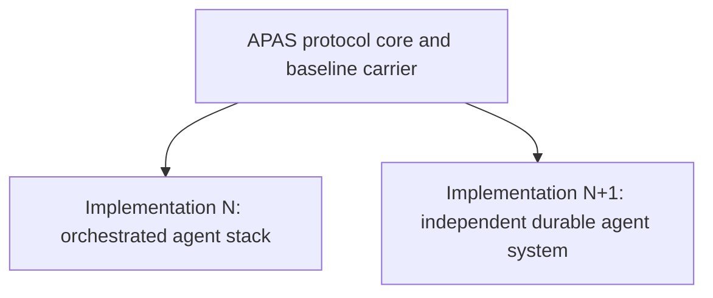

# Agent Provenance Attestation Standard (APAS)

**Version**: APAS 0.4.0-draft
**Status**: Draft
**Authors**: Agentic Research
**Date**: 2026-08-12

APAS versions independently of every implementation. Always include the `APAS`
prefix when naming a version. Tags for this document use the
`apas/vX.Y.Z` namespace so they cannot be confused with implementation releases.

> **APAS 0.4 changes conformance semantics.** It defines conformance over a
> bounded agent Activity and declared evidence scope, makes assurance levels
> cumulative, and separates the protocol core from implementation profiles.
> Mechanisms inherited from the original ART implementation remain available
> in a non-normative profile; they are no longer universal requirements.

The key words MUST, MUST NOT, REQUIRED, SHALL, SHALL NOT, SHOULD, SHOULD NOT,
RECOMMENDED, NOT RECOMMENDED, MAY, and OPTIONAL in this document are to be
interpreted as described in BCP 14 when, and only when, they appear in all
capitals.

## Abstract

The Agent Provenance Attestation Standard (APAS) is a protocol for recording,
authenticating, appraising, and reconstructing the provenance of bounded AI-agent
Activities. An Activity is in scope when an AI Agent observes inputs, influences
decisions, invokes tools, or produces outputs whose provenance a Relying Party
needs to evaluate.

APAS defines a shared ontology, an additive assurance model, and a baseline
attestation carrier. It does not prescribe an orchestrator, runtime, isolation
technology, identity provider, storage system, or deployment topology. A
long-lived Workload may perform many Activities, and an Activity may span
multiple processes, machines, or periods of suspension. Workload identity and
Activity identity are therefore related but distinct.

### 0.1 Protocol roles

APAS uses established provenance and remote-attestation roles. A component MAY
fill more than one role, except where a claimed assurance level requires those
roles to be independently controlled.

| Role | APAS meaning |
|---|---|
| **AI Agent** | Software or a model-mediated system that observes, decides, invokes tools, or emits outputs during an Activity. In W3C PROV terms it is an Agent associated with the Activity. |
| **Workload** | A deployed software instance or collection of code and configuration that performs Activities. Its identity may be expressed using SPIFFE or another identity system. |
| **Attester** | Produces Evidence about an Activity, Workload, execution boundary, or Entity. |
| **Verifier** | Appraises Evidence against policy and produces an Attestation Result. |
| **Relying Party** | Uses an APAS attestation or Attestation Result to make a decision. |

The complete vocabulary is normative and defined in Appendix A.

### 0.2 Normative references

APAS reuses these specifications rather than creating incompatible equivalents:

| Specification | APAS use |
|---|---|
| [RFC 2119](https://www.rfc-editor.org/rfc/rfc2119) and [RFC 8174](https://www.rfc-editor.org/rfc/rfc8174) | Normative requirement language (BCP 14) |
| [W3C PROV-DM](https://www.w3.org/TR/prov-dm/) | Entity, Activity, Agent, Plan, and causal relations |
| [SPIFFE Concepts](https://spiffe.io/docs/latest/spiffe-about/spiffe-concepts/) | Workload and Workload identity terminology |
| [IETF RATS Architecture, RFC 9334](https://www.rfc-editor.org/rfc/rfc9334) | Attester, Evidence, Verifier, Attestation Result, and Relying Party roles |
| [CloudEvents 1.0](https://github.com/cloudevents/spec/blob/v1.0.2/cloudevents/spec.md) | Event records of Occurrences |
| [in-toto Statement v1](https://in-toto.io/Statement/v1) | Baseline attestation statement |
| [DSSE](https://github.com/secure-systems-lab/dsse/blob/master/protocol.md) | Baseline authentication envelope at L2 and above |
| [SLSA v1.0](https://slsa.dev/spec/v1.0/) | Additive assurance and protected provenance generation |

OpenTelemetry Events and software-bill-of-materials formats are informative
integrations, not APAS ontology or carrier requirements.

### 0.3 Protocol architecture

The protocol sits above implementations. Implementations are siblings: they
interoperate through APAS records and profiles, not by depending on one another.



An implementation can distribute APAS roles across a hypervisor, cluster
service, agent runtime, identity authority, and storage tier, or combine them
where the claimed assurance level permits. Topology is expressed by profiles;
it is not part of the core ontology.

### 0.4 Activity lifecycle

An Activity has a stable identity and one or more Segments. Suspension ends a
Segment without ending the Activity. A conforming resume starts a new Segment
under the same Activity only after continuity has been verified.

```mermaid
stateDiagram-v2
  [*] --> Active: start Event
  Active --> Active: append Event
  Active --> Suspended: suspend and checkpoint
  Suspended --> Active: verify continuity; start new Segment
  Active --> Ended: end Event
  Suspended --> Ended: cancel, expire, or unrecoverable error
  Ended --> [*]
```



Continuity binds the checkpoint, effective authority, and every
behavior-changing configuration input. `Ended` is terminal: retrying work
creates a new Activity and MAY relate it to the prior Activity. Lifecycle state,
termination reason, and work outcome are distinct claims. For example, an
Activity may end normally with a failed outcome, or expire with an unknown
outcome.

## 1. Problem statement

AI agents increasingly modify source code, operate services, reconcile desired
state, and produce decisions consumed by other systems. Existing software supply
chain records identify components and build steps, but do not necessarily capture
the bounded agent Activity that selected inputs, invoked tools, exercised
authority, and generated an output. Without that provenance:

- agent work may be indistinguishable from human or conventional automation;
- compromised agent infrastructure can inject outputs through a trusted path;
- investigators cannot reliably connect outputs to relevant inputs, tool use,
  authority, or lifecycle transitions; and
- Relying Parties cannot verify that declared execution constraints were
  independently observed and appraised.

APAS addresses the record and its assurance. It does not establish that an
agent's reasoning was correct, require disclosure of private chain-of-thought,
or replace review of the resulting work.

### 1.1 Supply-chain lessons

The March 2026 compromise of Trivy demonstrated three lessons relevant to agent
provenance:

1. Mutable references are attack surfaces; security-relevant inputs and outputs
   need content-bound identities.
2. Long-lived, ambient credentials increase persistence and blast radius;
   authority should be short-lived, scoped, and attributable to its use.
3. Self-recording is not independent appraisal; stronger claims require a
   Verifier and protected authority outside the Activity being appraised.

These lessons constrain APAS assurance claims without prescribing one runtime or
credential format.

### 1.2 Why an SBOM is insufficient

SBOMs such as CycloneDX and SPDX answer, “Which components are present?” APAS
answers, “Which bounded agent Activity used and generated these Entities, which
Agent and Workload were associated with it, what relevant Occurrences were
recorded as Events, under what authority did it operate, and what Evidence
supports those claims?”

| Property | SBOM | APAS provenance |
|---|---|---|
| Primary subject | Components | Agent Activity and related Entities |
| Temporal model | Inventory or point-in-time snapshot | Lifecycle, Segments, Events, and causal relations |
| Identity | Package or publisher | Activity, Agent, Workload, Evidence producer, and authority |
| Verification | Digests and publisher metadata | Authenticated records and, at higher levels, independent appraisal |
| Outcome | Component presence | Distinct lifecycle, termination, and work-outcome claims |

A Workload is not an Activity. A Workload is long-lived deployed software and
may conduct many Activities. An Activity is the bounded provenance subject whose
identity persists across its Segments. A process, job, request, dispatch, run,
reconciliation, or capsule MAY map to an Activity or Segment under a topology
profile, but none of those implementation terms is universal.

## 2. Assurance levels

APAS defines four cumulative assurance levels. A level is claimed for one
Activity and one declared evidence scope, not for a product, cluster, or
collection of components in the abstract. A conforming claim MUST identify the
APAS version, claimed level, Activity, evidence scope, and applied profiles.

### 2.0 Conformance rule

Each higher level includes every requirement of the preceding level for the same
Activity and evidence scope. Profiles MAY add requirements or define mechanisms,
but MUST NOT waive, weaken, or silently reinterpret a core requirement.
Implementation status and reference mappings are non-normative.

Properties supplied by different components cannot be mechanically unioned into
a level. For example, a protected runtime, an unrelated signed log, and a
separate identity service do not jointly establish L3 unless their Evidence and
identities are bound to the same Activity, scope, and causal record.

Every level below states explicit failure conditions. A claim that cannot be
falsified from the declared records and Evidence is not a conformance claim.
Algorithms, envelope encodings, product names, and deployment topology belong in
the baseline carrier or profiles unless a level explicitly requires a security
property they provide.

### L1 — Recorded Agent Activity

**Requirement:** The Activity is represented by a structured record sufficient
to identify its declared provenance and interpret its lifecycle and outcome.

An L1 record MUST contain:

- a stable Activity identity that correlates every Segment, including Segments
  before and after suspension;
- the associated AI Agent and Workload identity, including the model and model
  provider when known and an explicit unknown value when not known;
- references to behavior-changing input Entities and generated output Entities;
- Events for tool operations and other Occurrences relevant to the declared
  capture scope;
- lifecycle state, termination reason, and work outcome as separate fields;
- claimed causal relations among the Activity, Agent, Plan, Entities, Events,
  and any parent or child Activities; and
- a declared capture scope identifying intentionally omitted classes of Events,
  Entities, or data.

L1 is a forensic record, not a security boundary. Its producer may alter or
forge it, and unknown information remains unknown even when the record is
well-formed.

**Fails** if resume loses the stable Activity correlation; a relevant tool
operation inside the declared capture scope is omitted; unknown model, time,
origin, or outcome data is represented as known; or termination/completion can
be interpreted as successful work without a distinct outcome claim.

### L2 — Authenticated Provenance

**Requirement:** L2 includes L1 and authenticates the Activity record and its
Evidence references so a third party can verify who produced each claim and
whether its signed content changed.

An L2 APAS attestation MUST:

- authenticate the complete L1 information set and every Evidence reference
  within the claimed evidence scope;
- name the producer identity in a form a Relying Party can bind to an
  independently configured trust policy;
- permit offline or third-party verification without treating the producer or
  the producer's current transport endpoint as the sole trust anchor;
- fail closed when signing authority is absent, unreadable, expired, revoked, or
  otherwise unusable; and
- bind claimed ordering or causal predecessor relations into authenticated
  content rather than filenames, timestamps, or storage layout alone.

L2 establishes authenticity and tamper evidence for the producer's claims. It
does not establish that the producer observed the Activity correctly, that the
Activity was isolated, or that a signed claim is true.

**Fails** if a signed-looking artifact can be emitted with an empty or missing
signature; verification accepts trust material supplied only by the same
untrusted producer as its root; an Evidence reference can be substituted without
invalidating authentication; or records that claim strict order can be reordered
without detection.

### L3 — Independently Appraised Execution

**Requirement:** L3 includes L2 and binds the Activity to protected execution
Evidence that is appraised by a Verifier outside the Activity's authority.

For L3:

- security-relevant Evidence MUST be protected from alteration or deletion by
  the Activity after the underlying Occurrences take place;
- the Activity and its Workload MUST NOT have access to the Verifier's protected
  appraisal state or Attestation Result signing authority;
- unrelated Activities MUST be isolated from observing or altering one another's
  private execution state except through declared channels;
- the effective tool, filesystem, network, credential, and other capability set
  MUST be bounded, declared, enforced, and default-deny;
- the declaration MUST describe what the Activity could do, not only what the
  record says it did; and
- a Verifier independent of the Activity MUST appraise the protected Evidence
  and bind its Attestation Result to the Activity and evidence scope.

Interactive authorization and predeclared capabilities are both valid
mechanisms when they fail closed. Advisory metadata is not enforcement. A label
such as “destructive” or “read-only” does not change the capability set unless a
boundary refuses disallowed operations.

L3 supports the claim that the declared execution constraints were independently
observed and appraised. It does not establish that inputs were benign, the Agent
made correct decisions, or the resulting work succeeded.

**Fails** if the Activity can forge or rewrite its protected receipts; protected
history is mutable without detection; the Activity can use the appraisal key or
modify Verifier policy/state; unrelated Activities can read or modify each
other's undeclared state; an undeclared operation succeeds; or an Attestation
Result is not bound to the same Activity and Evidence being claimed.

### L4 — Content-complete Reconstruction

**Requirement:** L4 includes L3 and provides authenticated commitments sufficient
to detect omission, reordering, substitution, or mutation of every captured item
needed to reconstruct the Activity within its declared scope.

For L4:

- every behavior-changing input MUST be bound by content, including instructions,
  context, model and sampling configuration, tool definitions, policy,
  credentials or authority, and resume configuration;
- the Workload and runtime MUST be identified precisely enough to distinguish
  behavior-relevant builds and configuration;
- generated outputs and the Event history MUST be retained or committed by
  content sufficiently for reconstruction within the declared capture scope;
- each behavior-changing input MUST resolve to origin Evidence or an explicit
  `origin-unknown` claim; origin coverage does not imply that an origin is
  trusted or content is safe;
- continuity across Segments MUST bind the checkpoint, effective authority, and
  behavior-changing configuration, and missing or reordered Segments MUST be
  detectable;
- mutation of a referenced Plan, input, output, checkpoint, Event, Evidence item,
  or other reconstructed Entity MUST be detectable; and
- the attestation MUST declare retention, redaction, sampling, and confidentiality
  limits so omitted content cannot be mistaken for complete capture.

L4 establishes content-complete reconstruction only within the declared capture
scope. Cryptographic integrity and attribution do not prove semantic correctness,
safety, policy fitness, determinism, or a successful outcome.

**Fails** if changing a behavior-relevant input can leave all authenticated
commitments unchanged; a resume can preserve Activity identity after checkpoint,
authority, or configuration drift; a Segment or captured Event can be removed or
reordered without detection; mutation of retained content is undetectable; origin
absence is treated as trusted origin; or sampled/redacted records are presented
as complete.

### 2.5 Content origin across levels

Content origin is an Entity and Evidence property, not a fifth assurance level.
It is meaningful from L2 upward because an unauthenticated origin record can be
revised by the same party that chose what to consume. L2 authenticates the
claim; L3 can protect Evidence of how content entered the Activity; L4 requires
coverage for every behavior-changing input, including an explicit
`origin-unknown` claim when no origin Evidence exists.

Origin coverage and origin trust are different. L4 requires the former so
silence cannot masquerade as knowledge. A Relying Party's policy decides whether
`origin-asserted`, `origin-unknown`, or only `origin-attested` content is
acceptable.

This matters because the usual way to keep an agent safe is to shrink what
it may read — a hardcoded safelist of sources. That does not scale: every
new source is a policy change, and a context-starved agent produces worse
work, which pressures operators into widening the list anyway.

Content origin does **not** make a wider corpus safer. Be precise about what
it buys, because the temptation to overclaim here is exactly how a standard
becomes a rubber stamp: origin makes the *record* of what was consumed
complete and attributable. Widening the corpus remains a risk decision. What
changes is that it becomes an **accountable** one — after an incident you can
enumerate what the Activity consumed and who vouched for each source, and
before one you can require that everything consumed be `origin-attested`
under your own trust set. A safelist answers "may I read this?" once, at
policy-authoring time, and then stops recording. Origin answers it
continuously and leaves evidence.

The honest summary: safelists trade capability for safety; origin trades
neither, and instead converts an invisible risk into a measured one.
§5.1's threat table states the residue plainly — poisoned input is
*attributed*, not *detected*.

**Origin entry.** An origin entry is a pair:

    OriginEntry := (uri, vouchedBy)

`uri` names where the content came from. `vouchedBy` is a single
**authority identifier** — the name of the party vouching for that
attribution. It is deliberately not a boolean, and deliberately not a list:
content vouched by two authorities is *two entries*, which keeps both the
ordering comparator and the dedup rule defined over a pair of plain
strings.

> **Why an authority, not a trust bit.** The point of ingest cannot know
> the evaluator's trust set. A substrate that stamps `trusted: true` has
> encoded *its* opinion into a record that some other party, with a
> different trust set, must later evaluate. Recording *which authority
> vouched* keeps the record a statement of fact and defers the judgment to
> whoever is judging.

An empty `vouchedBy` (the empty string) is an ordinary, expressible state
— "ingested, unvouched" — not an error and not an absence. A system that cannot express
"I have this content and nobody vouches for where it came from" will
instead express nothing, and silence is the worst record.

**Composition.** Content derived from multiple sources carries the union of
their origin entries, canonically ordered and deduplicated by the *pair*.
The same URI vouched by two authorities is two entries, because it is two
facts — and collapsing them into one entry with two authorities would
destroy the total ordering that makes origin sets comparable.

**Derived confidence.** Confidence is not stored; it is *derived* at
evaluation time from an origin set and the evaluator's own trusted-authority
set:

| Confidence | Condition |
|---|---|
| `origin-attested` | every entry is vouched by an authority the evaluator trusts |
| `origin-asserted` | origins are recorded, but some are unvouched or vouched by an untrusted authority |
| `origin-unknown` | no origin information (**including the empty set**) |

Derivation MUST fail closed: an empty origin set yields `origin-unknown`, never
`origin-attested` by vacuous truth. An implementation MUST NOT equate L4 origin
coverage with an `origin-attested` trust decision.

**The category line (normative).** *Who submitted* content is a fact about an
Agent or authority associated with an Activity. *Where the Entity's content came
from* is an origin claim about that Entity. An implementation MUST NOT fold the
submitting identity into the content's origin set.

> This is not a style preference; it was learned by getting it wrong. An
> early cut of the reference implementation unioned the authenticated
> submitter into every content origin set. The result inverted the
> incentive: a caller who declared nothing got `origin-attested` (the only
> entry being their own authenticated identity), while a caller who
> honestly declared an untrusted upstream got `origin-asserted`. Silence
> outranked honesty. Worse, it let an authenticated identity launder itself
> into content provenance — the exact confusion between "I know who is
> talking" and "I know what they are telling me about" that this section
> exists to prevent.

**Bounds.** Declared origin sets MUST be bounded (the reference
implementation uses 64 entries, 2048 bytes per URI) and an over-limit
declaration MUST be **refused, not truncated** — truncating records a claim
narrower than the caller actually made, which is a forged record rather
than a partial one.

**Privacy.** An origin set is disclosure surface: source URIs are an agent's
read history, and publishing them is a strictly richer oracle than whatever
existence-leak the carrier already had. The rule therefore depends on *who
can read the carrier*, not on what kind of artifact it is:

- **Broadcast carriers** — anything readable by parties not entitled to the
  origins, such as a response header returned to every caller or a public
  attestation feed — MUST carry only `originsHash`, a digest over the
  canonical encoding.
- **Scoped carriers** — a record whose distribution is already restricted
  to entitled parties, such as an attestation held at rest in an access-
  controlled store — MAY carry the full array.

An implementation MUST decide which case a given carrier is, and MUST
default to the digest when unsure. A signed attestation is *not*
automatically a scoped carrier: signing establishes integrity, never
confidentiality.

**What it proves**: "This content's attribution is recorded, and named
authorities stand behind that attribution."

**What it does NOT prove**: that the content is safe, correct, or
non-malicious — see §5.2 threat 5. Origin is *accountability*, not safety.

## 3. Attestation Format

APAS uses the in-toto attestation framework with a custom predicate type.

### 3.1 Envelope

```json
{
  "_type": "https://in-toto.io/Statement/v1",
  "subject": [
    {
      "name": "example-42f1a3",
      "digest": { "sha256": "<work_item_content_hash>" }
    }
  ],
  "predicateType": "https://notme.bot/provenance/dispatch/v1",
  "predicate": { ... }
}
```

> **URI resolution**: `notme.bot` is the canonical namespace for APAS predicate
> schemas, and hosts the standard itself. Its separation from any orchestrator
> is deliberate — a predicate namespace owned by one orchestrator would make
> the schema hostage to that orchestrator's lifecycle.
>
> **Known coupling, stated plainly**: this namespace is a single
> organization's domain. A predicate URI is an identifier rather than a
> fetch target, so an implementation does not depend on that domain
> resolving at verification time — but the *naming authority* is
> centralized, and a wider adoption of APAS would need to move these URIs
> under a neutral namespace. Until then, treat the string as a versioned
> constant: implementations MUST match predicate URIs literally and MUST NOT
> dereference them to decide how to parse a payload.

### 3.2 Predicate: `dispatch/v1`

```json
{
  "dispatchDefinition": {
    "workItemRef": {
      "repo": "example-repo",
      "workItemId": "example-42f1a3",
      "contentHash": "sha256:abc123..."
    },
    "pipeline": {
      "phases": ["scoping-agent", "dev-agent", "staging-agent"],
      "currentPhase": 1,
      "pipelineId": "uuid"
    },
    "agent": {
      "name": "dev-agent",
      "definition": "sha256:<hash of agent .md file>",
      "provider": "provider-name",
      "model": "model-version",
      "permissionProfile": "implement"
    }
  },
  "runDetails": {
    "orchestrator": {
      "name": "example-orchestrator",
      "version": "0.1.0",
      "identity": {
        "identityToken": "SIG1.<payload>.<signature>",
        "bridgeCert": "<base64 DER>"
      }
    },
    "execution": {
      "workDir": "/path/to/worktree",
      "startedAt": "2026-03-25T00:00:00Z",
      "completedAt": "2026-03-25T00:05:00Z",
      "durationMs": 300000,
      "sessionId": "uuid",
      "pid": 12345,
      "isolationLevel": "git-worktree"
    },
    "work": {
      "commits": [
        {
          "sha": "abc123",
          "message": "[example-42f1a3] fix(store): fast-fail connect",
          "signature": "<git signature>"
        }
      ],
      "filesChanged": ["src/store/mod.rs", "src/scanner.rs"],
      "linesAdded": 47,
      "linesRemoved": 12
    },
    "verification": {
      "passed": true,
      "highestTier": 2,
      "tiers": [
        {"name": "commit-check", "passed": true},
        {"name": "work-item-ref-check", "passed": true},
        {"name": "diff-sanity", "passed": true}
      ]
    },
    "cost": {
      "totalUsd": 0.47,
      "inputTokens": 14000,
      "outputTokens": 1678
    },
    "outcome": {
      "success": true,
      "stopReason": "end_turn",
      "workItemClosed": false
    },
    "handoffChain": {
      "phaseHash": "sha256:<hash of this phase>",
      "previousPhaseHash": "sha256:<hash of previous phase>",
      "chainRoot": "sha256:<hash of phase 0>"
    },
    "_comment": "contentOrigins in full form — valid ONLY for a scoped carrier (§2.5 Privacy). On a broadcast carrier this key is replaced by originsHash.",
    "contentOrigins": [
      {
        "uri": "https://docs.example.com/api/v2",
        "vouchedBy": "substrate/lease-gate"
      },
      {
        "uri": "context://repo/example-org/example-repo#pkg/example",
        "vouchedBy": ""
      }
    ]
  }
}
```

**`contentOrigins`** (§2.5, optional) is the origin set for content the
dispatch consumed. Rules that make it a record rather than a decoration:

- **Absent ≠ empty, where the carrier can express it.** Omitting the field
  asserts nothing about origins; present-and-empty (`[]`) says "we looked
  and there was nothing to record". Both derive `origin-unknown` and
  verifiers MUST NOT treat either as attested — the distinction is
  provenance about the *record*, not a confidence difference. A carrier
  that cannot represent it (the reference receipt encoding omits the field
  entirely when there is nothing to commit, precisely to stay
  byte-identical to pre-origin receipts) loses the distinction, which is
  acceptable: nothing normative depends on it.
- **`vouchedBy: ""`** means ingested-but-unvouched. It is expected in
  normal operation and MUST NOT be normalized away, dropped on
  serialization, or treated as an error. It is a single identifier, never
  a list — see §2.5.
- **Canonical ordering.** Entries are sorted by `uri` then `vouchedBy`,
  both compared as ASCII byte sequences, and deduplicated by the whole
  pair. Because both components are plain strings the comparator is total
  and implementation-independent — which is what makes an `originsHash`
  comparable across implementations at all.
- **No actor entries.** The dispatch's own identity, its orchestrator, and
  any authenticated submitter belong in `runDetails.orchestrator.identity`
  and the bridge cert — never here. See §2.5's category line.
- **Carrier rule.** On a broadcast carrier, replace `contentOrigins` with
  `originsHash` — a digest over the canonical encoding of the set that
  `contentOrigins` *would* have held. The two keys are mutually exclusive;
  an attestation carrying both is malformed, because it publishes on a
  broadcast carrier the very set the digest exists to withhold. See §2.5
  Privacy for which carriers are which.

The same predicate on a broadcast carrier therefore reads:

```json
{
  "runDetails": {
    "originsHash": "sha256:<digest of the canonical origin-set encoding>"
  }
}
```

A verifier holding only this can check that a disclosed set matches the
commitment, but cannot enumerate the set — which is the point. Obtaining
the set is a separate, scoped request (§2.5 Privacy).

### 3.3 Signing

The envelope is signed using DSSE (Dead Simple Signing Envelope):

```json
{
  "payloadType": "application/vnd.in-toto+json",
  "payload": "<base64(attestation)>",
  "signatures": [
    {
      "keyid": "sha256:<public key hash>",
      "sig": "<base64(ed25519 signature)>"
    }
  ]
}
```

### 3.4 Signing Key Hierarchy

Signing uses the identity model defined by the identity authority. APAS does not
define its own key format — it delegates to that role's existing specifications.

| Level | Key Type | Lifetime | Defined In |
|-------|----------|----------|------------|
| User master key | Ed25519 | Long-lived | [`pkg/crypto/algorithm/ed25519.go`](../../pkg/crypto/algorithm/ed25519.go) |
| Orchestrator bridge cert | X.509 + Ed25519 | Short-lived, per-dispatch | [`docs/design/004-bridge-certs.md`](../design/004-bridge-certs.md) |
| Dispatch session key | Ephemeral Ed25519 | Per-session | [`pkg/crypto/epr/proof.go`](../../pkg/crypto/epr/proof.go) |

The 4-entity identity model from [`pkg/sigid/`](../../pkg/sigid/) decomposes identity as:
- **Owner**: the human user who authorized the dispatch
- **Machine**: the host running the dispatch
- **Actor**: the agent persona (dev-agent, staging-agent) — a definition, not a running instance
- **Identity**: the cryptographic key binding all three to the running **dispatch** (the execution carrying the bridge-cert)

The bridge cert IS the dispatch's identity. One Actor (agent definition) can produce many dispatches, each with its own short-lived bridge cert.

The shared signing primitive supports both RFC 5652 (signed attributes) and
RFC 8419 (PureEdDSA). The reference orchestrator's shipped handoff-envelope
path currently signs with its own Ed25519 implementation; consolidation onto
the shared primitive remains a target (§7.3).

### 3.5 Predicate Splitting (Future)

> **Note**: The `dispatch/v1` predicate bundles dispatch definition, execution,
> work, verification, cost, and handoff chain into a single predicate. This is
> pragmatic for v0.1 but may need splitting in future versions — SLSA deliberately
> separates `buildDefinition` from `runDetails` so different parties can attest
> to different parts. A candidate split:
>
> - `https://notme.bot/provenance/dispatch-definition/v1` — what was intended (work-item, pipeline, agent)
> - `https://notme.bot/provenance/dispatch-execution/v1` — what happened (timing, work, cost)
> - `https://notme.bot/provenance/dispatch-verification/v1` — what was verified (tiers, outcome)
>
> Note: `https://notme.bot/provenance/handoff/v1` is already defined as the
> predicate type for phase handoff attestations (distinct from the dispatch
> predicate which covers the full execution).

## 4. Hash Chain Structure

### 4.1 Element Hashes **[TARGET — shipped handoff hash is narrower]**

The hierarchy below is the target contract. The reference orchestrator
currently implements work-item content hashes (`BeadSpec::content_hash()`) and
a content-linked handoff hash at the Phase boundary (`Handoff::chain_hash()`),
but the latter is
not yet the full `H(Phase)` defined below. The shipped handoff hash covers phase
number, agent name, work-item ID, summary, changed file paths, commit SHAs, and
the previous handoff hash. It does not yet cover agent-definition content,
bridge-cert identity, provider, or tool/action hashes. Lower levels (ToolCall,
FileChange) and upper levels (WorkItemGroup, WorkItemLifecycle) also remain
target design.

```
H(FileChange)        = SHA256(path || old_content || new_content)
H(ToolCall)          = SHA256(tool_name || input_hash || output_hash || timestamp)
H(Action)            = SHA256(H(ToolCall_0) || H(ToolCall_1) || ... || H(ToolCall_n))
H(Phase)             = SHA256(agent_definition || dispatch_identity || provider || H(Action) || H(previous_phase))
H(WorkItem)          = SHA256(H(Phase_0) || H(Phase_1) || ... || H(Phase_n))
H(WorkItemGroup)     = SHA256(H(WorkItem_0) || H(WorkItem_1) || ... || H(WorkItem_m))
H(WorkItemLifecycle) = SHA256(H(WorkItemGroup_0) || H(WorkItemGroup_1) || ... || H(WorkItemGroup_k))
```

Target `H(Phase)` inputs:
- `agent_definition` — content hash of the agent's `.md` file (the persona).
- `dispatch_identity` — the dispatch's bridge-cert subject (the running execution that produced this Phase).
- `provider` — implementation-defined model provider identifier.
- Both `agent_definition` and `dispatch_identity` are required so a conformant Phase
  binds the *what-was-supposed-to-run* to *what-actually-ran*.

> **Implementation mapping** *(reference implementation, non-normative)*:
> - `WorkItem` → *bead* (a file-scoped task tracked in `.beads/`).
> - `WorkItemGroup` → *thread* (an ordered group of related beads).
> - `WorkItemLifecycle` → *decade* (an ADR-level grouping of threads).
>
> The hash hierarchy is orchestrator-agnostic — any APAS implementation
> supplies its own work-item / grouping / lifecycle primitives that satisfy
> the corresponding `H(...)` contract. These names are illustrative anchors,
> never normative wire vocabulary.

### 4.2 Chain Properties

The target hierarchy has the properties below. The shipped handoff chain
currently provides tamper evidence and ordering across Phase handoffs;
completeness and a root spanning the full work-item hierarchy remain targets.

- **Tamper-evident**: Modifying any element changes its hash, which propagates upward
- **Ordered**: The chain encodes temporal ordering via sequential hashing
- **Complete**: A valid chain requires all elements; gaps are detectable
- **Rooted**: The decade hash is the root of trust for the entire work decomposition

> **SHA-256 vs git SHA-1**: APAS uses SHA-256 throughout. Git commit SHAs
> (currently SHA-1, transitioning to SHA-256) are included in `Handoff::commit_shas`
> and hashed into `chain_hash()` as opaque byte strings — binding the provenance
> chain to the actual code committed. When git repos opt into SHA-256 object
> format, the commit references will be natively compatible with APAS hashes.

### 4.3 Content-Linked Chain Hash (Shipped)

> **Shipped in the reference orchestrator** (`fix(handoff): content-linked
> chain hash`). Its `Handoff` struct carries `previous_chain_hash: Option<String>` —
> the hex-encoded SHA-256 produced by `chain_hash()` on the previous phase's
> `Handoff` struct (hashing phase, agent, bead_id, summary, files, commit SHAs,
> and the prior chain link — not raw JSON bytes). `chain_hash()` includes this
> hash, not a file path. Replacing a handoff file without knowing its hash breaks the chain.
>
> The reference orchestrator added `commit_shas: Vec<String>` to `Handoff`, binding the chain to
> the actual committed code — two handoffs with identical summaries but different
> commits produce different hashes.
>
> See the reference orchestrator's `src/handoff.rs` for the implementation and
> chain_hash test suite.

## 5. Adversarial Model

### 5.1 Threats Addressed

Columns L1–L4 are cumulative levels. The **origin** column is *not* a level
and does not sit between L3 and L4 in any ordering — it is a property that
can be present at any level from L2, shown here so its coverage can be
compared against the levels' (see §2.5).

| Threat | L1 | L2 | L3 | L4 | *origin* (§2.5) |
|--------|----|----|----|----|----|
| Forged dispatch identity | - | Detected | Detected | Detected | Detected |
| Tampered attestation | - | Detected | Detected | Detected | Detected |
| Phantom work-item injection | - | Detected (breaks chain) | Detected | Detected | Detected |
| Unauthorized tool use | - | - | Prevented | Prevented | - |
| Undisclosed content source | - | - | - | Detected | Detected |
| Identity laundered into content provenance | - | - | - | Prevented | Prevented (category line) |
| Poisoned dispatch input | - | - | - | Detected | **Attributed, not detected** |
| Compromised model provider | - | - | - | Forensic only | - |

The origin column is deliberately weaker than L4 on the row that matters
most. Origin attribution tells you *which source* a poisoned input arrived
from and *who vouched* for that attribution; it does not tell you the input
was poisoned. That is L4's job, and the gap between those two cells is the
honest measure of what a widened corpus costs.

### 5.2 Threats NOT Addressed (Red Team Findings)

1. **Compromised model provider**: If the LLM itself is poisoned, the agent produces correctly-signed malicious code. APAS provides forensic trail but cannot prevent this. Mitigation: adversarial review phase with different provider.

2. **Honest-but-curious agent**: An agent that signs everything correctly but exfiltrates data via tool calls. APAS L3 limits network access but cannot prevent all covert channels. Mitigation: network allowlisting + tool call audit.

3. **Time-of-check-time-of-use**: File modified between attestation and commit. Mitigation: atomic workspace snapshots (jj/git stash before signing).

4. **Self-attested provenance**: The orchestrator writes its own attestations. At L1-L2, this is the fox guarding the henhouse. L3 requires separation. L4 requires external witnesses.

5. **Origin is accountability, not safety** (§2.5): a vouched host serving attacker-controlled content yields a *correctly* vouched origin. `origin-attested` means "named authorities stand behind where this came from", never "this content is safe". An implementation that renders the tier as a safety signal in an operator-facing surface has mis-stated the guarantee. Mitigation: content scanning and review remain independent of provenance; provenance tells you *whom to ask* after the fact, and narrows *who could have* introduced something.

6. **Origin sets as a read-history oracle** (§2.5): the origin record that makes content admissible also describes what an agent has been reading. An attacker who can observe origin sets learns the shape of an agent's context — which sources exist, which are consulted together, and when a new one appears. This is why §2.5 requires a digest commitment on observable channels and scoped disclosure elsewhere; it is a mitigation, not an elimination, since digests still leak equality and cardinality across observations.

## 6. Relationship to Existing Standards

| Standard | Relationship |
|----------|-------------|
| SLSA | APAS levels parallel SLSA levels. APAS dispatch predicate extends SLSA provenance. |
| in-toto | APAS uses in-toto Statement/v1 envelope format and DSSE signing. |
| CycloneDX | APAS complements CycloneDX SBOM. Agent metadata could be a CycloneDX AI/ML-BOM component. |
| SCAI | APAS verification tiers parallel SCAI attribute assertions. |
| Sigstore | APAS signing chain is compatible with Sigstore's keyless signing model (via OIDC -> ephemeral cert). |

## 7. Reference Implementation

The reference implementation and its supporting primitives span several
repositories. A component's presence here does not by itself establish an APAS
conformance level; the status statements below describe the implemented
relationship precisely.

### 7.1 Rosary (Orchestrator)

The orchestrator implementation is documented at `rosary.bot`, with identity
issuance at `auth.notme.bot`.

- `src/handoff.rs` — Phase handoff, tool-call records, content-linked chain hashing, and commit-SHA binding (L1, partial L2)
- `src/dsse.rs` — in-toto Statement v1 handoff envelope, optional Ed25519 signing, and verification (partial L2)
- `src/manifest.rs` — Dispatch manifest capture (L1)
- `src/session.rs` — Session tracking (L1)
- `src/acp.rs` — ACP permission handling (L3 foundation)
- `crates/bdr/` — Work decomposition with content hashing (L1)

### 7.2 Signet (Identity)

- `pkg/crypto/epr/` — Ephemeral proof-of-possession (L2)
- `pkg/crypto/algorithm/` — Ed25519 signing (L2)
- Bridge certificates — Delegated identity (L2)
- OIDC token exchange — Federated identity (L2)

### 7.3 Ley-line (Signing + Storage)

- `ley-line-open/rs/ll-open/sign/` (`leyline-sign` crate) — CMS/PKCS#7 Ed25519 signing primitive; Rosary has not yet consolidated its DSSE signer onto it
- Signed Merkle-CAS heads — content-addressed, verifiable storage primitive for future witnessing

### 7.4 Notme (Public APAS Surface)

- `notme.bot/apas` — non-normative summary of this draft
- `notme.bot/provenance/...` — canonical namespace reserved for APAS predicate schemas
- `auth.notme.bot` — identity and certificate authority used by the reference stack

### 7.5 Cloister (Boundary and Origin Mechanism)

Cloister is not an APAS attester and should not become one — §1.1's third
lesson is that the auditor must not be the audited, and Cloister's value
here depends on it producing evidence that a *different* party wraps. But
"not the attester" is not the same as "adjacent", which is how earlier
drafts filed it. Two specific things changed:

- **It is the L3 mechanism.** L3's requirements — sandboxed execution, an
  orchestrator that cannot modify the dispatch workspace, mediated tool
  calls, network restricted to declared endpoints, filesystem scoped to the
  workspace — are Cloister's confinement facet nearly line for line
  (`fs.allow` / `network.allowHosts` / `port.bind`, digested as
  `confinement/v1`, committed into the bundle certificate and verified
  before the sandbox is entered). §7.6's L3 row is corrected accordingly.
- **It is the reference implementation of §2.5.** ADR-0065 ships the origin
  vocabulary this draft adopts: origin entries as (uri, vouchedBy) with
  authority identifiers, union as composition, confidence derived against
  the evaluator's trust set and failing closed on the empty set, digest
  commitment on the observable channel.

Cloister's receipts still do not use the APAS in-toto/DSSE predicates, and
receipt emission does not by itself establish conformance at any level.
**Nothing in this draft claims Cloister is L4-conformant**: by ADR-0065's
own accounting, two of L4's five requirements remain partial, and L4's
runtime-SBOM requirement is only approximated by image pinning.

- **Mache** projects structured code and repository context through filesystem
  and MCP interfaces. Its responses are candidate L4 inputs; APAS hashing and
  inclusion of those responses are not yet implemented. Under §2.5, a Mache
  response is content whose origin is the projection it came from — the
  natural first consumer of `declaredOrigin`.

### 7.6 Implementation Status and Next Steps

| Status | Conformance | What | Where |
|--------|-------------|------|-------|
| Shipped | L1 partial | Dispatch manifests, session streams, handoffs, and tool-call records | rosary |
| Shipped | L1 / L2 foundation | Content-linked handoff chain including commit SHAs | rosary |
| Partial | L2 | in-toto handoff statements in DSSE envelopes; signed only when configured | rosary |
| Target | L2 | Signed dispatch manifests and commits; shared signing implementation | rosary + signet + ley-line |
| Partial | §2.5 | Content origin: entries, union, derived confidence, digest commitment | cloister (ADR-0065) |
| Target | §2.5 | Scoped disclosure of origin sets to entitled parties | cloister |
| Target | §2.5 | Adopt origin entries in APAS predicates (not only substrate receipts) | rosary + signet |
| Partial | L3 | The **boundary** mechanism: declared fs/network/port confinement, digested and committed into the bundle certificate, verified before the sandbox is entered | cloister + LLO |
| Target | L3 | The **attestation** that the boundary held, bound to a dispatch identity | rosary (attester) |
| Target | L4 | Hash prompts, work-item descriptions, model context, and MCP responses | rosary + mache |
| Target | L4 | External witnessing of APAS attestations | ley-line |

> The L3 row previously named rosary alone, while the isolation substrate
> L3 describes was being built in cloister and LLO. Both halves are real and
> they are different halves: rosary owns the dispatch and writes the
> attestation; cloister owns the boundary the attestation claims held. The
> split is exactly §1.1's third lesson, so the row now names both rather
> than letting a reader of either document guess wrong about the other.

### 7.7 An Independent Implementation (Reconciler Profile)

Everything in §7.1–§7.6 is one ecosystem. This section records a **second,
independently built** implementation, because a standard with one implementer
is a design document with a standard's title.

The system is an agentic reconciler framework: its unit of work is a **key
reconciled to convergence**, not a dispatch. There is no dispatching agent to
name as a distinct entity, and no phase handoff between distinct agents. It
was not built with APAS in mind and does not reference it.

Measured against the levels:

| | Property | Status in the reconciler profile |
|---|---|---|
| L2.1 | signed by producer | ✅ attestations signed via a keyless workload identity |
| L2.2 | third-party verifiable, no trust in producer at check time | ✅ verified against a trusted root, with a transparency log |
| L2.3 | signing identity pinnable | ✅ verification pins an expected identity |
| L2.5 | ordering carried in content | ❌ no chain |
| L3.1 | attester cannot modify workspace | ❌ attester and agent share a process |
| L3.3 | bounded, declared, default-deny capabilities | ✅ **by omission** — a tool absent from the host's callback set does not exist in the model's tool list |
| L3.4 | capability set attested | ❌ declared but not attested |
| L4.1 | behaviour-changing inputs bound by content | ⚠️ instructions, tool definitions, and sampling are digested together — but into a resume-control record, not an attestation |
| L4.2 | runtime identified | ⚠️ provider SDK version recorded; no SBOM |
| L4.3 | model outputs retained | ✅ full turn, reasoning, and tool-call records |
| L4.5 | outcome ≠ completion | ✅ **the source of this property** (see L4.5) |

Three findings follow, and each is about APAS rather than about that system.

**1. It satisfies L2 while failing most of L2's original bullets.** Its
signing identity is externally certified, whereas the orchestrator profile's
L2 key is held by the same component that writes the attestations — the
"fox guarding the henhouse" L2's own note flags. On the property that
matters it is *stronger*, while matching almost none of the prose. That is
what motivated §2.0.

**2. It has the evidence and lacks the attestation — at every level.** It
signs reconciliation status rather than agent provenance; its run traces go
to telemetry unsigned; its input digest lives in a checkpoint record. The
integration gap is not cryptographic. Nearly everything L4 asks for is
already captured; none of it is attested.

**3. A run is not one execution.** Runs suspend and resume across process
boundaries, identified by a run ID rather than by a process, with a
fail-closed check that the configuration has not drifted under the pause. Any
APAS model assuming a run is one continuous execution cannot describe this —
and the drift check is *already* the L4.1 claim, expressed for a different
purpose. Where the phase boundary belongs when a run legitimately stops and
restarts is an open question for a future revision.

## 8. The 5 Whys

**Why do we need agent provenance?**
-> Because AI agents autonomously modify source code in production repositories.

**Why is that a risk?**
-> Because we cannot distinguish agent work from human work after the commit is made.

**Why does that matter?**
-> Because supply chain attacks can inject malicious code via compromised agent pipelines.

**Why can't existing tools catch this?**
-> Because SBOMs track components (static), not decision chains (temporal + causal + identity-bound).

**Why is a decision chain different from a component list?**
-> Because it requires: (1) temporal ordering of actions, (2) causal linking between phases, (3) identity binding to specific agents/users, (4) scope verification (did the agent stay within its permissions?), and (5) input/output integrity (were the agent's inputs and outputs consistent?).

**Rock bottom**: The fundamental unit of trust in software is "who changed what, when, and why." For human developers, git blame + code review provides this. For autonomous agents, we need a cryptographically verifiable equivalent. APAS is that equivalent.

## Appendix A: Glossary

This appendix is the canonical vocabulary for normative APAS sections. The
classifications describe roles in the protocol and are not necessarily disjoint.
In particular, a receipt can be an Event because it records an Occurrence, an
Entity because it is data used or generated by an Activity, and Evidence because
a Verifier can appraise it.

- **AI Agent**: Software or a model-mediated system that observes inputs,
  influences decisions, invokes tools, or produces outputs during an Activity.
  It is a W3C PROV Agent associated with that Activity. A model, persona, policy,
  or runtime component may contribute to the Agent's identity but is not by
  itself the Activity.
- **Activity**: A bounded execution or course of agent work that is the unit of
  APAS provenance and conformance. It has a stable identity, lifecycle, declared
  evidence scope, and causal relations to Agents and Entities. It may span
  multiple processes, machines, and Segments.
- **Segment**: One continuous portion of an Activity. Suspension ends a Segment;
  verified resume begins another Segment under the same Activity identity.
- **Workload**: Long-lived deployed software, including its relevant code and
  configuration, that performs one or more Activities. This follows SPIFFE usage
  and does not imply deterministic behavior.
- **Workload identity**: An identity assigned to a Workload instance or class of
  Workloads. It identifies what is performing an Activity, not the Activity
  itself. SPIFFE IDs are one possible representation.
- **Entity**: A physical, digital, conceptual, or other thing with fixed aspects
  relevant to provenance, following W3C PROV. Inputs, outputs, checkpoints,
  configuration, model artifacts, prompts, receipts, and attestations may be
  Entities.
- **Plan**: An Entity describing intended actions, constraints, or goals for one
  or more Activities, following W3C PROV. A Plan is intent, not proof that its
  instructions were followed.
- **Occurrence**: Something that happens in or affects an Activity, such as a
  tool invocation, policy decision, lifecycle transition, or output emission.
  An Occurrence is the fact in the world; it may exist without a retained record.
- **Event**: A structured record of an Occurrence. Events identify their source
  and Activity and may carry ordering or causal claims. Event follows CloudEvents
  usage; an OpenTelemetry Event is one optional encoding.
- **Evidence**: Information appraised by a Verifier when evaluating claims about
  an Activity, Entity, Workload, or execution environment, following RATS.
  Evidence may be inline or content-addressed by an APAS attestation.
- **Attester**: A role that produces Evidence about an Activity, Workload,
  Entity, or execution boundary, following RATS.
- **Verifier**: A role that appraises Evidence against policy and produces an
  Attestation Result, following RATS. “Independent” means the Activity cannot
  control the Verifier's protected state or result-signing authority.
- **Attestation Result**: A Verifier's output from appraising Evidence against
  policy, including the claims evaluated, result, and relevant policy or trust
  context. It is not synonymous with raw Evidence.
- **Relying Party**: A role that consumes an APAS attestation or Attestation
  Result to make a decision, following RATS.
- **APAS attestation**: An authenticated statement that makes APAS claims about
  one Activity and a declared evidence scope using the baseline carrier or a
  losslessly mapped alternative carrier. An L1 record is provenance but is not
  an authenticated APAS attestation.
- **Profile**: A named, versioned set of additional constraints or mappings for a
  carrier, Activity topology, Evidence type, identity system, or implementation.
  Profiles may add requirements but cannot waive the requirements of a claimed
  APAS assurance level.
- **Origin entry**: A pair `(uri, vouchedBy)` recording where an Entity's content
  came from and which authorities vouch for that attribution. `vouchedBy` may be
  empty; “ingested, unvouched” is a claim distinct from missing origin data.
- **Vouching authority**: A named party asserting an origin attribution. APAS
  records the identifier rather than a universal trust bit because each
  evaluator has its own trust policy.
- **Derived confidence**: `origin-attested`, `origin-asserted`, or
  `origin-unknown`, computed at evaluation time from origin entries and the
  evaluator's trusted authorities. It is not stored as an intrinsic property of
  content.
- **Origin set**: The canonical, whole-pair-deduplicated union of origin entries
  for an Entity.

## Appendix B: Domain Separation

| Domain | Canonical URI | Purpose |
|--------|--------------|---------|
| `notme.bot` | `https://notme.bot/provenance/...` | APAS standard — predicate schemas, spec documentation |
| `auth.notme.bot` | `https://auth.notme.bot/` | Signet identity authority — certificate issuance |
| `rosary.bot` | `https://rosary.bot/` | Rosary orchestrator — reference implementation docs |
