# APAS 0.4 Protocol Rewrite Implementation Plan

> **For agentic workers:** REQUIRED SUB-SKILL: Use superpowers:subagent-driven-development (recommended) or superpowers:executing-plans to implement this plan task-by-task. Steps use checkbox (`- [ ]`) syntax for tracking.

**Goal:** Rewrite APAS 0.3.1-draft into an agent-specific, implementation-neutral APAS 0.4.0-draft with cumulative assurance levels, a baseline interoperable carrier, composable profiles, and an honest mapping to two sibling implementations.

**Architecture:** One normative core defines agent Activities, lifecycle, Events, Evidence, appraisal roles, and cumulative levels. A mandatory in-toto Statement plus DSSE baseline keeps APAS interoperable, while topology, identity, carrier details, origin encoding, and the existing `dispatch/v1` schema live in named profiles. The ART stack is the first complete reference implementation; an anonymous durable-reconciliation implementation validates portability without depending on ART.

**Tech Stack:** Markdown, Mermaid, JSON examples, W3C PROV, SPIFFE, IETF RATS, CloudEvents, OpenTelemetry, in-toto Statement v1, DSSE, SLSA.

## Global Constraints

- Modify the APAS specification and documentation only; do not change Signet code in this plan.
- Keep APAS explicitly about AI-agent provenance.
- Keep `docs/apas/agent-provenance-standard.md` self-contained; Appendix A is the canonical glossary.
- Do not add YAML frontmatter or create a separate glossary file.
- Do not name Driftless, Chainguard, Cloudflare, or a workplace implementation in the rewritten specification.
- Keep the ART stack non-normative: Rosary, Cloister, Ley-line-open, Signet, Notme, and Mache may appear only in reference mappings, profiles, history, or implementation status.
- Preserve a mandatory baseline in-toto Statement v1 carrier and DSSE authentication at L2 and above.
- Preserve the full content-origin model, including evaluator-derived confidence, unknown/unvouched states, scoped disclosure, and digest-only broadcast disclosure.
- Preserve `dispatch/v1`, bridge certificates, phase handoffs, hash chaining, and exact ART mechanisms as a non-normative profile or compatibility mapping.
- A conformance level applies to one Activity and declared evidence scope; component features cannot be mechanically unioned into a level.
- Every normative conformance property must include a falsification condition.
- Never require hidden chain-of-thought; record only observable agent outputs or explicitly declared rationale.
- Preserve the user's untracked `.gemini/`, `.superpowers/`, and `codex-resume.txt` paths.
- Every commit must use `[signet-ded9d4] <type>(<scope>): <subject>`.

---

### Task 1: Establish the APAS 0.4 scope, ontology, and lifecycle

**Files:**
- Modify: `docs/apas/agent-provenance-standard.md`
- Reference: `docs/superpowers/specs/2026-08-11-apas-0.4-design.md`

**Interfaces:**
- Consumes: approved APAS 0.4 design terms and lifecycle invariants.
- Produces: canonical definitions used verbatim by later conformance, carrier, threat, and mapping sections.

- [x] **Step 1: Replace version notes, Abstract, Roles, and normative references**

Set the document version to `APAS 0.4.0-draft`. State that APAS covers bounded agent Activities in which AI agents observe inputs, influence decisions, invoke tools, or produce outputs. Replace product-shaped normative roles with W3C PROV, SPIFFE, and RATS roles. Retain an explicit change note saying 0.4 changes conformance semantics and moves ART mechanisms into profiles.

- [x] **Step 2: Rewrite the problem statement using Activity vocabulary**

Keep the agent and supply-chain motivation, SBOM distinction, mutable-reference lesson, short-lived-authority lesson, and independent-appraisal lesson. Remove the claim that a dispatch is analogous to a SPIFFE Workload. State that Workload identity and Activity identity are distinct.

- [x] **Step 3: Add the protocol architecture and lifecycle diagrams**

Add a sibling-implementation Mermaid flowchart with APAS above implementation N and anonymous implementation N+1, with no dependency arrow between them. Add this state machine using Mermaid syntax that avoids escaped newlines in transition labels:

```mermaid
stateDiagram-v2
  [*] --> Active: start Event
  Active --> Active: append Event
  Active --> Suspended: suspend and checkpoint
  Suspended --> Active: verify continuity; start new Segment
  Active --> Ended: end Event
  Suspended --> Ended: cancel, expire, or unrecoverable error
  Ended --> [*]
```



Immediately below it, state in prose that continuity binds checkpoint, authority, and behavior-changing configuration; Ended is terminal; and lifecycle state, termination reason, and work outcome are distinct.

- [x] **Step 4: Expand Appendix A into the canonical glossary**

Define AI Agent, Activity, Segment, Workload, Workload identity, Entity, Plan, Occurrence, Event, Evidence, Attester, Verifier, Attestation Result, Relying Party, APAS attestation, and Profile. State that Event is a record of an Occurrence and that Event, Entity, and Evidence roles may overlap.

- [x] **Step 5: Run the ontology consistency check**

Run:

```bash
rg -n 'analogous to SPIFFE|workload.*determin|Every dispatch|dispatch is the unit|dispatch.*identity in APAS' docs/apas/agent-provenance-standard.md
```

Expected: no normative statement equates Workload with Activity or makes dispatch universal. Historical or profile occurrences, if already present in untouched later sections, are noted for Task 3 rather than treated as completion.

- [x] **Step 6: Commit the ontology pass**

```bash
git add docs/apas/agent-provenance-standard.md
git diff --cached --check
git commit -m '[signet-ded9d4] docs(apas): define the agent activity ontology'
```

---

### Task 2: Replace the maturity ladder with cumulative assurance levels

**Files:**
- Modify: `docs/apas/agent-provenance-standard.md`

**Interfaces:**
- Consumes: Activity, Segment, Event, Entity, Workload, Evidence, Attester, Verifier, and Attestation Result from Task 1.
- Produces: stable L1–L4 requirements consumed by the carrier, threat model, and implementation mappings.

- [x] **Step 1: Rewrite the conformance reading rule**

Define conformance over one Activity and declared evidence scope. State that levels are cumulative, profiles may add but not waive requirements, implementation status is non-normative, and component properties are not mechanically unioned.

- [x] **Step 2: Write L1 — Recorded Agent Activity**

Require stable Activity identity, Agent and Workload association, input/output Entities, model identity, tool-operation Events, lifecycle state, termination reason, outcome, and claimed causal relations. Include explicit failures for lost resume correlation, missing relevant operations, unknown treated as known, and termination treated as success.

- [x] **Step 3: Write L2 — Authenticated Provenance**

Require authentication of the L1 record and Evidence references, named producer identity, independently rooted third-party verification, fail-closed signing, and content-bound ordering claims. Include explicit failures for signed-looking unsigned fallback, issuer-supplied trust as the sole anchor, and reorderable records.

- [x] **Step 4: Write L3 — Independently Appraised Execution**

Require protected Evidence, inaccessible Attestation Result authority, isolation among unrelated Activities, declared and enforced default-deny capabilities, and appraisal by a Verifier outside the Activity's authority. Include explicit failures for forgeable receipts, mutable protected history, execution access to appraisal keys, and undeclared successful operations.

- [x] **Step 5: Write L4 — Content-complete Reconstruction**

Require content binding for every behavior-changing input, precise runtime/Workload identity, output and Event-history retention or commitment, origin Evidence or explicit unknown, checkpoint/authority/configuration continuity, detectable missing or reordered Segments, mutation detection, and declared capture scope. State that integrity and attribution do not prove correctness or safety.

- [x] **Step 6: Preserve and integrate the full origin model**

Keep origin as an Entity/Evidence property meaningful from L2 upward. At L4 require coverage, not trust: each behavior-changing input resolves to origin Evidence or explicit `origin-unknown`. Retain `vouchedBy`, evaluator-derived confidence, absent-versus-empty semantics, unvouched entries, actor/origin separation, broadcast digest disclosure, scoped full disclosure, and confidentiality warnings.

- [x] **Step 7: Check cumulative and falsifiable wording**

Run:

```bash
rg -n '^### (Level|L)[1-4]|\*\*Fails?\*\*|includes L[1-3]|origin-unknown' docs/apas/agent-provenance-standard.md
```

Expected: four levels in order, each higher level explicitly includes the prior level, each level has falsification text, and L4 refers to `origin-unknown`.

- [x] **Step 8: Commit the assurance pass**

```bash
git add docs/apas/agent-provenance-standard.md
git diff --cached --check
git commit -m '[signet-ded9d4] docs(apas): make assurance levels cumulative'
```

---

### Task 3: Define the baseline carrier and composable profiles

**Files:**
- Modify: `docs/apas/agent-provenance-standard.md`

**Interfaces:**
- Consumes: the L1 information set and L2 authentication properties from Task 2.
- Produces: an implementable `activity/v1` baseline plus compatibility homes for existing ART mechanisms.

- [ ] **Step 1: Replace the universal `dispatch/v1` format with the baseline logical statement**

Define required logical fields: APAS/profile versions, claimed level, subject Entity digests, Activity identity/lifecycle, Agent/Workload associations, used/generated Entities, Events or Event commitments, scoped Evidence references, termination reason, outcome, Attestation Result where required, and declared capture scope.

- [ ] **Step 2: Add a valid generic in-toto Statement JSON example**

Use `_type: https://in-toto.io/Statement/v1` and `predicateType: https://notme.bot/provenance/activity/v1`. The predicate must use generic Activity vocabulary and contain no dispatch, phase, bead, bridge-certificate, or ART product field.

- [ ] **Step 3: Define Event and Evidence-reference fields**

For inline Events require source, event ID, type, Activity, optional Segment, occurrence time or explicit unknown, Entity references, and event data. For strict ordering require sequence or causal predecessor. For Evidence references require profile type, media type, digest, producer identity, and Activity or Segment scope.

- [ ] **Step 4: Retain DSSE as the L2+ baseline**

Keep the DSSE example and fail-closed rule. State that the signature algorithm and trust mechanism come from an identity profile. Clarify that the `notme.bot` predicate URI is a versioned identifier, not a trust anchor, online dependency, or requirement to use Notme credentials.

- [ ] **Step 5: Define profile axes**

Add carrier, Activity-topology, Evidence, and identity profiles. Define orchestrated, durable, and reconciliation Activity topologies as composable. State that alternate carriers must identify themselves and map losslessly to the baseline logical statement.

- [ ] **Step 6: Move existing mechanisms into the ART profile**

Preserve `dispatch/v1`, bridge certificates, Owner/Machine/Actor/Identity, Ed25519/CMS implementation, phase handoffs, work-item hierarchy, content-linked hashes, SHA-256 APAS commitments, CAS digests, git details, cost, and verification tiers in a clearly non-normative ART profile and compatibility subsection.

- [ ] **Step 7: Replace the normative hash hierarchy with causal and commitment rules**

Use PROV-style `used`, `wasGeneratedBy`, `wasAssociatedWith`, and `wasInformedBy`, plus parent/child Activity and Event/Occurrence relations. Require content-bound sequence/predecessor/hash/Merkle commitments only when strict ordering or completeness is claimed. State that timestamps and sampled telemetry do not prove completeness.

- [ ] **Step 8: Parse every JSON example**

Run:

```bash
awk '/```json/{on=1; next} /```/{if(on){on=0; print "---"}; next} on' docs/apas/agent-provenance-standard.md
```

Copy each emitted block separated by `---` into `jq empty` using a temporary file under `/tmp`; all blocks must parse. Do not write generated validation files into the repository.

- [ ] **Step 9: Commit the carrier/profile pass**

```bash
git add docs/apas/agent-provenance-standard.md
git diff --cached --check
git commit -m '[signet-ded9d4] docs(apas): define baseline carrier and profiles'
```

---

### Task 4: Align threats, standards, reference mapping, and compatibility

**Files:**
- Modify: `docs/apas/agent-provenance-standard.md`

**Interfaces:**
- Consumes: core model, levels, carrier, and profiles from Tasks 1–3.
- Produces: a coherent security claim and honest mapping from the protocol to implementations N and N+1.

- [ ] **Step 1: Rewrite the threat matrix in core vocabulary**

Use Activity, Entity, Event, Evidence, Attester, Verifier, and Attestation Result. Cover forged identity, tampered record, unbound Evidence, unauthorized capability use, missing/sampled Events, missing Segments, configuration drift across resume, origin disclosure, termination/outcome conflation, and compromised model provider.

- [ ] **Step 2: Preserve threats not addressed**

Retain compromised provider, covert-channel limits, time-of-check/time-of-use, self-attestation below L3, origin-is-not-safety, and origin-set disclosure. Add that APAS does not validate the semantic correctness of an outcome or require private chain-of-thought.

- [ ] **Step 3: Rewrite the standards relationship table**

Map W3C PROV to ontology, SPIFFE to Workload identity, RATS to appraisal roles, in-toto/DSSE to the baseline carrier, SLSA to additive assurance/protected provenance generation, CloudEvents to Event records, OpenTelemetry to optional Evidence encoding, and CycloneDX to complementary inventory.

- [ ] **Step 4: Rewrite the ART reference mapping**

Map Rosary to Plans/capsules/Activities/Events/outcomes, Cloister to boundaries/capabilities/receipts/origins, Ley-line-open to execution contracts/CAS/receipt and storage primitives, Signet to identity/signature verification, Notme to principals/delegation/authority/public schema, and Mache to projected input Entities. State that the complete composition implements APAS properties and no component alone inherits the aggregate level.

- [ ] **Step 5: Rewrite the independent validation example anonymously**

Describe a durable reconciliation Activity with stable identity, turn/tool Events, checkpoints, configuration drift detection, OCI subject, and an independent signing stack. State exactly which evidence remains unsigned or unbound and therefore which level cannot yet be claimed. Do not name a company, product, or workplace.

- [ ] **Step 6: Add the original-requirement disposition appendix**

Include a compact table that accounts for every original mechanism as core, baseline carrier, ART profile, implementation status, or intentional removal with rationale. Explicitly list the seven rejected universals from the approved design.

- [ ] **Step 7: Run the normative-coupling scan**

Run:

```bash
rg -n '\b(Rosary|Cloister|Ley-line|Signet|Notme|Mache|dispatch|bead|handoff|bridge cert|Ed25519|CMS)\b' docs/apas/agent-provenance-standard.md
```

Expected: each match is within change history, a profile, reference mapping, compatibility section, or implementation-status text. Move any normative-core match to the appropriate profile.

- [ ] **Step 8: Commit the security and mapping pass**

```bash
git add docs/apas/agent-provenance-standard.md
git diff --cached --check
git commit -m '[signet-ded9d4] docs(apas): align threats and implementation mappings'
```

---

### Task 5: Verify the complete rewrite and prepare PR #175

**Files:**
- Modify if needed: `docs/apas/agent-provenance-standard.md`
- Modify: `docs/superpowers/plans/2026-08-12-apas-0.4-protocol-rewrite.md` only to check completed boxes if the execution workflow tracks them in-file.

**Interfaces:**
- Consumes: the complete APAS 0.4 draft.
- Produces: reviewable and mechanically checked PR branch state.

- [ ] **Step 1: Scan for placeholders and stale claims**

Run:

```bash
rg -n 'TBD|TODO|FIXME|0\.3\.1-draft|CURRENT|PARTIAL|TARGET|Driftless|Chainguard|Cloudflare' docs/apas/agent-provenance-standard.md
```

Expected: no placeholders, stale implementation markers in level headings, or named independent/workplace implementation.

- [ ] **Step 2: Verify section and glossary coverage**

Run:

```bash
rg -n '^## |^### ' docs/apas/agent-provenance-standard.md
rg -n '^[-*] \*\*(AI Agent|Activity|Segment|Workload|Workload identity|Entity|Plan|Occurrence|Event|Evidence|Attester|Verifier|Attestation Result|Relying Party|APAS attestation|Profile)\*\*' docs/apas/agent-provenance-standard.md
```

Expected: the architecture, lifecycle, L1–L4, origin, baseline carrier, profiles, adversarial model, standards, reference mapping, disposition audit, glossary, and domain separation sections all exist; all sixteen canonical glossary terms are defined.

- [ ] **Step 3: Validate JSON and Mermaid blocks**

Parse all JSON blocks with `jq empty`. Validate Mermaid using an installed repository-supported renderer. If none is installed, check both blocks against Mermaid's documented syntax and simplify labels to plain single-line text; record the missing renderer as a tooling limitation rather than claiming rendered verification.

- [ ] **Step 4: Run repository checks**

Run:

```bash
git diff --check origin/main...HEAD
task all
task lint
```

Expected: all three commands exit 0. If a repository gate fails for an unrelated environmental reason, record the exact command and failure without marking the gate passed.

- [ ] **Step 5: Review the final diff against the design disposition audit**

Run:

```bash
git diff --stat origin/main...HEAD
git diff -- docs/apas/agent-provenance-standard.md
```

Confirm that every row in `docs/superpowers/specs/2026-08-11-apas-0.4-design.md` §15 has a visible destination and that the rewrite contains no accidental product coupling.

- [ ] **Step 6: Commit any verification corrections**

```bash
git add docs/apas/agent-provenance-standard.md docs/superpowers/plans/2026-08-12-apas-0.4-protocol-rewrite.md
git diff --cached --check
git commit -m '[signet-ded9d4] docs(apas): finish the 0.4 consistency pass'
```

Skip this commit if verification required no corrections and the plan file is not being updated in-place.

- [ ] **Step 7: Update the bead and publish the branch**

Record verification results and remaining implementation follow-up on `signet-ded9d4`. Push `docs/apas-core-profile-split`, confirm PR #175 checks, and leave the PR in draft until the user approves the rewritten normative document.

- [ ] **Step 8: Track Signet code conformance separately**

Search beads for an `activity/v1`/APAS code-conformance task. If none exists, create a separate implementation bead scoped to Signet schema/code/tests and link it as discovered from `signet-ded9d4`. Do not implement it in this documentation plan.
