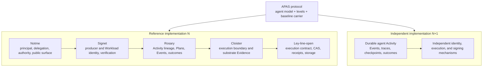

# APAS 0.4 Protocol Redesign

**Status:** Written design for review

**Date:** 2026-08-11

**Tracking:** `signet-ded9d4`

**Target:** `docs/apas/agent-provenance-standard.md` on PR #175

## 1. Objective

Revise the Agent Provenance Attestation Standard (APAS) section by section so
that it remains explicitly about AI-agent provenance while becoming a protocol
that can be implemented by more than the ART reference ecosystem.

The redesign preserves a baseline interoperable envelope. It separates:

1. APAS's agent-specific information and assurance model;
2. its baseline wire representation;
3. optional, composable mechanism profiles; and
4. non-normative implementation mappings and status.

The ART ecosystem—Rosary, Cloister, Ley-line-open, Signet, and Notme—is the
first complete reference implementation. A second, independently constructed
durable-reconciliation implementation is the portability test. The two are
sibling implementations of APAS; neither depends on the other.

## 2. Scope and non-goals

APAS covers **agent Activities**: bounded periods in which one or more AI
agents observe inputs, influence decisions, invoke tools, or produce outputs.
An Activity can span process replacement, suspension, resumption, and multiple
execution Segments while retaining one logical identity.

APAS remains an agent-provenance protocol. It does not become a generic job,
workflow, telemetry, or remote-attestation protocol. It adopts terms from
those domains where they already solve the underlying problem.

This documentation change does not:

- change Signet code or any sibling repository;
- require a separate `glossary.md`;
- introduce a YAML-frontmatter or documentation metadata system;
- extract APAS into another repository;
- name a workplace implementation in normative or example text; or
- claim a conformance level that has not been demonstrated over a composed
  Activity and its evidence scope.

Signet code conformance is separate follow-on work after this document is
settled.

## 3. Protocol architecture

APAS core sits above sibling implementations. The ART stack may use multiple
profiles internally; another implementation may use a different decomposition
while satisfying the same core and baseline carrier.

There is deliberately no dependency arrow between implementation N and N+1.
The second implementation validates that APAS describes assurance rather than
one repository topology.

## 4. Canonical terminology

Appendix A of the APAS document remains the canonical glossary. The main text
may summarize these terms but must not redefine them locally.

| Term | APAS meaning | Standards basis |
|---|---|---|
| **AI Agent** | Model-mediated software that materially influences an Activity. It is a kind of software Agent. | W3C PROV Agent |
| **Activity** | The logical, bounded unit whose agent provenance APAS describes. | W3C PROV Activity |
| **Segment** | One contiguous execution interval of an Activity. Resume creates a new Segment when continuity verifies. | APAS extension |
| **Workload** | Software deployed and configured for a purpose; it may perform many Activities and have multiple instances. | SPIFFE |
| **Workload identity** | A verifiable identity for a Workload, distinct from an Activity identifier. | SPIFFE ID / SVID |
| **Entity** | An input, output, configuration, checkpoint, model, tool definition, Plan, desired-state record, or other thing used or generated by an Activity. | W3C PROV Entity |
| **Plan** | An optional Entity describing intended actions. Desired state may be an Entity without prescribing steps. | W3C PROV Plan |
| **Occurrence** | A fact or transition during or about an Activity. | CloudEvents occurrence; PROV instantaneous-event semantics |
| **Event** | A data record expressing an Occurrence and its context. Multiple Events may express one Occurrence. | CloudEvents Event |
| **Evidence** | An artifact used as input to appraisal. Event records, receipts, origin sets, and checkpoints may play this role. | RATS Evidence |
| **Attester** | The role that produces Evidence about an environment or execution. | RATS Attester |
| **Verifier** | The role that appraises Evidence under policy. | RATS Verifier |
| **Attestation Result** | The Verifier's appraisal of Evidence. | RATS Attestation Result |
| **Relying Party** | The consumer that uses an Attestation Result to make a decision. | RATS Relying Party |
| **APAS attestation** | An authenticated provenance statement binding an Activity, relevant Entities, Evidence, and any Attestation Result. | APAS |
| **Profile** | A composable contract for a carrier, Activity topology, identity mechanism, or Evidence source. | APAS |

These classifications are roles rather than disjoint storage types. A signed
load-event receipt can simultaneously be an Event, a stored Entity, and
Evidence. A terminal run receipt is usually aggregate Evidence about several
Occurrences rather than one Event.

## 5. Activity lifecycle

The protocol defines the minimum lifecycle needed to reason about durable
agent execution. Profiles may add states but may not weaken the identity and
continuity rules.

```mermaid
stateDiagram-v2
  direction LR

  [*] --> Active : start Event
  Active --> Active : Occurrence / append Event
  Active --> Suspended : suspend Event + checkpoint Entity
  Suspended --> Active : continuity verified / resume Event; new Segment
  Active --> Ended : end Event
  Suspended --> Ended : cancel, expire, or unrecoverable error
  Ended --> [*]

  note right of Suspended
    Resume preserves Activity identity only when Evidence
    binds checkpoint, authority, and behavior-changing configuration.
  end note

  note right of Ended
    Termination reason is not work outcome.
    An Ended Activity may have a failed, degraded, or unknown outcome.
  end note
```

An Ended Activity never resumes. A retry after Ended is a new, related
Activity. A separately attributable agent invocation, delegation, authority
scope, or independently appraised result may be represented as a child
Activity rather than a Segment.

Lifecycle state, termination reason, and work outcome are distinct:

- lifecycle state is Active, Suspended, or Ended;
- termination reason describes how execution stopped; and
- work outcome describes whether intended work succeeded.

## 6. Cumulative conformance levels

Conformance attaches to a specific Activity and declared evidence scope, not
to a repository, library, VM, signer, or CAS in isolation. Levels are
cumulative. Each normative property has an explicit falsification condition.

### 6.1 L1 — Recorded Agent Activity

L1 requires a structured, machine-readable, reconstructable record containing:

- a stable Activity identity across Segments;
- associated AI Agents and Workloads;
- relevant Plan or desired-state Entities;
- the goal or intent and decision-relevant agent outputs or declared rationale
  when the system produces them, without requiring hidden chain-of-thought;
- input and output identifiers;
- model identity, including per-turn changes when applicable;
- Events that distinguish attempted, failed, recovered, and terminal tool
  operations;
- lifecycle state, termination reason, and timestamps or explicit unknowns;
- work outcome distinct from termination; and
- causal relations to parent, child, predecessor, and successor Activities
  when such relations are claimed.

L1 fails if resumption loses correlation, a relevant operation disappears, an
unknown is silently treated as known, or Ended is interpreted as succeeded.
L1 provides forensic value but no tamper-resistance.

### 6.2 L2 — Authenticated Provenance

L2 includes L1 and requires:

- authentication covering the asserted record and Evidence references;
- a named, pinnable producer identity;
- third-party verification using independently established trust;
- fail-closed behavior when signing authority is unavailable; and
- content-bound ordering or causality whenever ordering is claimed.

L2 fails if unsigned fallback resembles a signed artifact, the only trust root
comes from the issuer being checked, or records can be reordered without
invalidating an ordering claim.

### 6.3 L3 — Independently Appraised Execution

L3 includes L2 and requires:

- the Activity cannot rewrite protected Evidence after capture;
- the Activity cannot access the authority signing the Attestation Result;
- execution is isolated from unrelated Activities;
- effective capabilities are declared, enforced default-deny, and evidenced;
  and
- a Verifier outside the Activity's authority appraises execution Evidence.

L3 fails if the executing Workload can forge its receipt, modify the protected
event history, use the Attestation Result's signing key, or perform an
undeclared operation.

### 6.4 L4 — Content-complete Reconstruction

L4 includes L3 and requires:

- every behavior-changing input is content-bound, including instructions,
  desired state, model, tool definitions, sampling configuration, and base
  revision;
- runtime and Workload versions are precisely identified;
- outputs and the relevant Event history are retained or content-bound;
- every behavior-changing input has origin Evidence or an explicit
  `origin-unknown` result;
- suspension and resumption bind checkpoint, authority, and configuration;
- missing or reordered Segments are detectable;
- mutation of inputs or outputs after use is detectable; and
- the completeness scope states what was and was not captured.

L4 fails if a prompt or tool definition can change without changing the
commitment, a required Segment can disappear undetected, or absent origin
information is interpreted as trusted origin.

L4 verifies integrity, coverage, and attribution. It does not establish that
content, a model, or an outcome is correct or safe.

### 6.5 Composition rule

A deployment claims the highest level for which every property is verified
for the same Activity and evidence scope. Component properties are not unioned
mechanically. For example, L3-quality substrate receipts and an unrelated
L1-quality event stream do not produce L3. The Verifier must establish that
the receipts cover the claimed Events and Segments.

Profiles may add requirements but may not waive core properties.

## 7. Baseline information model and carrier

APAS remains a protocol by retaining a mandatory baseline interoperability
profile rather than making every envelope optional.

The baseline logical statement contains:

- APAS and profile versions;
- conformance level claimed;
- subject Entity digests;
- Activity identity and lifecycle;
- Agent and Workload associations;
- used and generated Entities;
- Events or a content commitment to an Event set or sequence;
- Evidence references and their Activity or Segment scopes;
- termination reason and work outcome;
- Attestation Result where required; and
- declared capture and completeness scope.

The baseline wire profile uses an in-toto Statement v1 with the generic
predicate identifier `https://notme.bot/provenance/activity/v1`.

Each inline Event in the baseline identifies its source, event ID, type,
Activity, optional Segment, occurrence time when known, relevant Entity
references, and event-specific data. An Event claiming strict order also
identifies its sequence or causal predecessor. Source plus event ID identifies
the Event record for deduplication; it does not assert that only one Event can
represent the underlying Occurrence.

- At L1, an unsigned Statement is explicitly an L1 provenance record and must
  never be shaped or labeled as a signed envelope.
- At L2 and above, DSSE authenticates the Statement.
- The signature algorithm and trust mechanism are selected by a named identity
  profile; the baseline does not require Signet, bridge certificates, or one
  algorithm.
- Alternative carriers are conforming only when they identify their profile
  and define a lossless mapping to the baseline logical statement.

The `notme.bot` predicate URI is a versioned schema identifier, not a trust
anchor or identity mechanism. Verification must not depend on dereferencing it,
and use of the baseline does not require Notme credentials or services.

The existing `https://notme.bot/provenance/dispatch/v1` predicate remains an
ART orchestrated-activity profile. It is not the APAS core predicate.

## 8. Profiles

Profiles are orthogonal and composable rather than new assurance levels.

### 8.1 Carrier profiles

Carrier profiles define serialization, canonicalization, signature wrapping,
algorithm identifiers, and domain separation. The in-toto/DSSE baseline is the
required common carrier. Other carriers name themselves explicitly.

### 8.2 Activity-topology profiles

- **Orchestrated activity:** dispatches, phases, handoffs, work items, and
  parent/child Activities.
- **Durable activity:** one Activity across suspension and process replacement,
  with checkpoint-bound Segments.
- **Reconciliation activity:** desired state is an Entity used by repeated
  observations and actions until a terminal decision; no predetermined Plan
  is required.

These may be combined. A durable orchestrated Activity and a durable
reconciliation Activity are both valid.

### 8.3 Evidence profiles

Evidence profiles define how receipts, traces, checkpoints, capability sets,
origin sets, and event-stream commitments are produced and verified. Each
Evidence reference conceptually identifies:

- profile type;
- media type;
- digest;
- producer identity; and
- Activity or Segment scope.

An Evidence profile does not claim an APAS level by itself.

### 8.4 Identity profiles

Identity profiles define how Agents, Workloads, Attesters, Verifiers, and
producers are named and authenticated. SPIFFE/SVID, Signet/Notme credentials,
and other independently rooted mechanisms may implement this role.

## 9. Activity graphs, Events, and continuity

The current mandatory phase/work-item hash hierarchy becomes an ART profile.
The core instead uses these relations:

- an Activity `used` an Entity;
- an Entity `wasGeneratedBy` an Activity;
- an Activity `wasAssociatedWith` an Agent or Workload;
- an Activity `wasInformedBy` another Activity;
- an Activity has parent or child Activities; and
- an Event records an Occurrence about an Activity, Segment, or Entity.

Strict ordering requires a content-bound sequence, predecessor relation, hash
chain, Merkle structure, or equivalent commitment. Timestamps alone do not
prove ordering. A CloudEvents or OpenTelemetry representation is a profile,
not the APAS ontology. Telemetry that can be sampled away cannot establish
completeness without additional Evidence.

The ART profile retains content-linked handoff hashes, phase relationships,
work-item hierarchy, SHA-256 commitments, and dual CAS/APAS digests where
those are its interoperability contract.

## 10. Content origin

The current content-origin security model is retained, not compressed into one
L4 bullet:

- origin identifies where content came from, not who executed or submitted it;
- each origin entry names a URI and a vouching authority identifier;
- trust or confidence is derived by the evaluator against its own trust set;
- unvouched and unknown origins remain representable;
- origin is accountability, not safety or correctness;
- broadcast carriers disclose only an origin-set commitment;
- scoped carriers may disclose the canonical origin set; and
- signatures establish integrity, not confidentiality.

Origin Evidence may be present from L2 upward. At L4, every
behavior-changing input must resolve to origin Evidence or explicit
`origin-unknown`; L4 does not require every origin to be trusted.

Exact origin-set ordering, canonical encoding, `originsHash`, and disclosure
fields remain in the baseline/ART carrier profiles so implementations can
reproduce commitments byte-for-byte.

## 11. Adversarial model

The adversarial section is rewritten using Activity, Entity, Event, Evidence,
Attester, and Verifier. It retains the existing threats and adds falsification
coverage for:

- lost Activity identity across resume;
- missing or sampled Events;
- unbound substrate receipts;
- attestation-key access by the Activity;
- incomplete Segment coverage;
- conflation of termination, work outcome, and appraisal result; and
- silent interpretation of unknown origin as trusted origin.

The standard continues to state that it does not prevent a compromised model
provider, all covert channels, malicious but correctly attributed content, or
incorrect domain judgments.

## 12. Relationship to existing standards

The document uses standards at their natural layers:

| Standard | APAS relationship |
|---|---|
| W3C PROV | Entity, Activity, Agent, Plan, and causal relations |
| SPIFFE | Workload, Workload identity, SPIFFE ID, and SVID vocabulary |
| IETF RATS | Attester, Evidence, Verifier, Attestation Result, and Relying Party roles |
| in-toto | Baseline Statement carrier and subject/predicate separation |
| DSSE | Baseline L2+ authentication wrapper |
| SLSA | Precedent for cumulative assurance and protected provenance generation |
| CloudEvents | Event as a record of an Occurrence and its context |
| OpenTelemetry | Optional trace/span/event Evidence encoding, not provenance ontology |
| CycloneDX | Complementary software and AI/ML component inventory |

## 13. Reference implementation and independent validation

Implementation status appears only in the non-normative reference section.

The ART mapping records:

- Rosary: Plans, capsules/Activities, phase child Activities, Events, handoffs,
  outcomes, and orchestration lineage;
- Cloister: enforced boundary, capability Evidence, receipts, event-stream
  commitments, and origin production;
- Ley-line-open: execution contract, CAS Entities, receipt primitives, signed
  storage, and reproducible content commitments;
- Signet: producer and Workload identity, signature and trust verification;
- Notme: principals, delegation, authority, and public schema surface; and
- Mache, where applicable: content projection whose outputs become input
  Entities rather than a mandatory APAS role.

The independent example is anonymous and mechanism-neutral. It demonstrates a
durable reconciliation Activity with a stable run identifier, turn/tool Events,
checkpoints, configuration drift detection, and a different signing stack. It
must not claim a level for properties its authenticated envelope does not bind.

## 14. Section-by-section rewrite

| Current section | APAS 0.4 treatment |
|---|---|
| Header and change notes | Bump to APAS 0.4.0-draft; state breaking conformance-model change. Keep visible metadata, no YAML frontmatter. |
| Abstract and Roles | Use the approved agent-Activity scope and standards roles. Move product mapping to the reference section. |
| §1 Problem Statement | Retain agent motivation and split-trust lesson; replace dispatch-only terminology. |
| §2 Levels | Replace with the cumulative L1–L4 properties and falsification rules in §6 of this design. Remove implementation status from headings. |
| §2.5 Origin | Preserve the full model and connect mandatory L4 coverage to it. |
| §3 Format | Introduce the baseline `activity/v1` logical statement and in-toto/DSSE carrier. Move `dispatch/v1` and key hierarchy to profiles. |
| §4 Hash Chain | Replace normative hierarchy with Activity/Event/Entity relations and continuity rules. Retain the hash hierarchy in the ART profile. |
| §5 Adversarial Model | Rewrite terms and add resume, omission, binding, and outcome/appraisal threats. |
| §6 Existing Standards | Add PROV, SPIFFE, RATS, CloudEvents, and OpenTelemetry; clarify in-toto/DSSE as the baseline carrier. |
| §7 Reference Implementation | Map the complete ART stack and an anonymous sibling implementation without claiming unverified levels. |
| §8 Five Whys | Retain agent-specific motivation; remove conclusions that depend on dispatch topology. |
| Appendix A | Expand into the canonical glossary in §4 of this design. |
| Appendix B | Retain domain separation as a core requirement; put exact labels and encodings in profiles. |

## 15. Original-requirement disposition audit

No original normative statement disappears silently.

| Original concept | Disposition |
|---|---|
| Agent pipeline and decision-chain motivation | Retained in core scope; generalized beyond one topology. |
| Dispatch manifest and JSON stream | Machine-readable L1 core requirement; concrete fields remain ART profile. |
| Tool-call audit | L1 Events with attempted/failed/recovered/terminal semantics. |
| Phase handoffs | Child Activity/Event mapping in ART profile. |
| in-toto Statement and DSSE | Retained as mandatory baseline carrier. |
| Fail-closed unsigned behavior | Retained at L2 and baseline-carrier rules. |
| Content hashes rather than paths | Retained as content-bound relationship requirement and ART profile vector. |
| Dispatch/commit signatures | Provenance authentication is core; git/commit specifics remain ART profile. |
| Bridge certificate and four-entity identity | Retained in ART identity profile. |
| CMS/Ed25519 implementation | Retained as ART carrier implementation, not universal algorithm. |
| Sandbox, workspace, network, and filesystem controls | L3 enforced-capability core plus execution-evidence profile. |
| Prompt, MCP response, work-item, model-output, and runtime binding | Retained and broadened under L4 behavior-changing inputs and outputs. |
| Phase/work-item/group/lifecycle hash hierarchy | Retained in ART profile; replaced in core by causal graph and commitment properties. |
| Origin entries, derived trust, privacy, and `originsHash` | Retained in full under §10 and carrier profiles. |
| Threat matrix and red-team findings | Retained and expanded using standards vocabulary. |
| Cost, git statistics, and verification tiers | Retained as optional ART predicate fields; not universal assurance properties. |
| Predicate splitting | Replaced by composable carrier, topology, Evidence, and identity profiles. |
| Implementation `[CURRENT]` / `[PARTIAL]` / `[TARGET]` | Moved to non-normative reference status. |
| Domain separation | Retained; exact labels move to profiles. |

The following are intentionally removed as universal claims:

- every agent Activity is a dispatch;
- every Activity has pipeline phases or handoffs;
- Workload implies deterministic execution;
- one product-specific certificate hierarchy is required;
- CAS, isolation, or a signature alone establishes a complete level;
- termination establishes work success; and
- known origin establishes safe content.

## 16. Validation

Before PR #175 is ready to merge:

1. Every original normative statement is accounted for by the disposition
   audit.
2. Every core property has a falsification sentence.
3. Product names, file paths, algorithms, and repository-specific nouns are
   absent from normative core requirements except for cited standards and the
   mandatory baseline carrier.
4. Every JSON example parses, and baseline examples use generic Activity
   vocabulary.
5. Every Mermaid block parses with the repository's supported renderer or is
   simplified until it does.
6. A terminology scan confirms that `dispatch`, `phase`, `handoff`, `bridge
   certificate`, and ART product names appear only in profiles, mappings,
   history, or explicitly non-normative examples.
7. The conformance table is applied to both the ART reference stack and the
   anonymous durable-reconciliation example without changing core definitions.
8. No implementation is credited with a level unless its authenticated
   evidence covers every property at that level for the same Activity.
9. Repository documentation checks and `git diff --check` pass.

## 17. Follow-on implementation work

After the APAS document is approved and merged, a separate Signet
implementation bead will map code and schemas to `activity/v1`, add conformance
vectors, and identify compatibility handling for existing `dispatch/v1`
artifacts. That work must follow the protocol rather than changing the protocol
to match current code.
